# STATOR: 통합 메모리 엣지 장치의 다중 프로세스 LLM 서빙을 위한 불변 상태 익스텐트

*STATOR: Immutable State Extents for Multi-Process LLM Serving on Unified-Memory Edge Devices*

Jetson AGX Thor에서 같은 LLM을 서빙하는 여러 프로세스가 모델 가중치와 공통
프롬프트 프리픽스의 KV 캐시를 물리 메모리 한 벌로 공유한다. GPU는 두 상태를
호스트 페이지 테이블을 통해 제자리에서 읽는다.

STATOR는 전동기에서 회전하지 않는 부분의 이름이다. 공유 상태는 불변으로 고정하고
각 프로세스가 쓰는 부분만 따로 둔다는 설계 규칙에서 이름을 가져왔다. 저장소
이름과 일부 스크립트, 기록 파일 이름에 남아 있는 LLM-Share는 이전 작업명이다.

- 연구 기록: [docs/RESEARCH_LLM_SHARE_2026-10-05.md](docs/RESEARCH_LLM_SHARE_2026-10-05.md) (KV 캐시는 6절)
- 기반 측정 기록: [docs/RESEARCH_HOSTMM_2026-10-05.md](docs/RESEARCH_HOSTMM_2026-10-05.md) (코드와 원시 결과는 `thor_hostmm` 프로젝트에 있으며 이 저장소에 포함되지 않는다)
- 선행 연구 조사: [docs/SOTA_HOSTMM_2026-10-05.md](docs/SOTA_HOSTMM_2026-10-05.md) 12, 14, 16, 17절, [docs/SOTA_AUDIT6_2026-10-06.md](docs/SOTA_AUDIT6_2026-10-06.md)
- 논문 원고: 별도 저장소에서 관리한다. 논문에 쓰는 그림은 `figures/make_paper_figures.py`로 만들고 `figures/sync_to_paper.sh`로 그 저장소의 `Figures/`에 복사한다.

목차: [1. 서론](#1-서론) | [2. 배경](#2-배경) | [3. 설계](#3-설계) |
[4. 평가](#4-평가) | [5. 한계](#5-한계) | [6. 구성물과 재현](#6-구성물과-재현) |
[7. 사용법](#7-사용법)

## 1. 서론

### 1.1 연구의 필요성

온디바이스 어시스턴트는 단일 모델 호출에서 다중 에이전트 구성으로 바뀌고
있다. 여러 프로세스가 같은 기반 모델을 사용하고, 시스템 프롬프트, 도구 설명,
참조 문서로 이루어진 같은 긴 프리픽스에서 출발한다.

통합 메모리 장치에서는 CPU와 GPU가 하나의 DRAM을 나누어 쓴다. 프로세스마다
중복해서 보유하는 상태는 그만큼 장치 전체의 메모리를 줄인다. 서빙 프로세스가
보유하는 상태는 두 가지이다.

- **가중치.** 7B 모델(Q4_K_M)은 4.4 GiB이다. 현재 엔진은 프로세스마다 가중치를
  디바이스 메모리에 복사한다. 프로세스 8개는 40.8 GiB를 차지한다.
- **KV 캐시.** 이 모델은 토큰당 56 KiB를 쓴다. 16,321토큰 프리픽스의 캐시는
  0.9 GiB이고, 32,768토큰 컨텍스트 전체는 1.75 GiB이다. 가중치를 공유한
  뒤에도 같은 프리픽스에서 출발한 에이전트 8개는 19.9 GiB를 차지한다. 이
  가운데 프리픽스 부분은 모든 에이전트에서 내용이 같다.

에이전트를 한 프로세스에 모으면 엔진이 프리픽스를 시퀀스 사이에서 공유한다.
그러나 에이전트가 서로 다른 프로그램이거나, 한 에이전트의 GPU 장애가 다른
에이전트로 전파되지 않아야 하거나, GPU의 두 MIG 인스턴스를 모두 사용해야 하는
경우에는 프로세스가 분리된다. 이 연구는 분리된 프로세스가 중복 없이 상태를
공유하는 방법을 다룬다.

### 1.2 기존 방법의 한계

프로세스 사이에서 상태를 공유하는 기존 수단은 이 장치에서 각각 한계가 있다.
근거는 2.3절에 있다.

- 엔진이 제공하는 상태 파일은 프리픽스를 프로세스마다 복사한다.
- 프로세스 내부의 프리픽스 공유는 프로세스 경계를 넘지 못한다.
- GPU 수준의 메모리 공유(CUDA IPC, CUDA 가상 메모리 인터페이스)는 MIG 인스턴스
  경계에서 거부된다.
- 커널의 copy-on-write는 GPU가 접근하는 메모리에서 정상적으로 동작하지 않는다.
  GPU의 읽기가 복사를 일으키고, 페이지 소유권이 바뀔 때마다 프로세스 전체의
  무효화 비용이 든다.

### 1.3 접근

Thor의 GPU는 호스트 페이지 테이블을 따라간다. 따라서 호스트 메모리 관리자가
GPU가 접근하는 메모리를 프로세스 사이에서, 그리고 MIG 인스턴스 사이에서 공유할
수 있다. STATOR는 copy-on-write를 쓰지 않는 다음 규칙을 세우고 llama.cpp에 두
가지로 구현한다.

> 공유 상태는 불변이며 읽기 전용으로 매핑한다. 프로세스가 쓰는 내용은 처음부터
> 그 프로세스의 사설 메모리에 둔다. 공유, 포크, 이동은 매핑에 대한 범위
> 연산으로 수행하며, GPU가 접근하는 페이지의 소유권이 폴트를 통해 바뀌지
> 않는다.

- **가중치 in-place.** 매핑한 모델 파일을 모든 프로세스의 가중치 버퍼로
  사용한다(`inplace_weights.patch`, 59줄).
- **KV 캐시 익스텐트.** 프리픽스를 계산한 프로세스가 그 행을 게시(publish)하고,
  다른 프로세스는 그 행을 읽기 전용으로 매핑한 뒤 자신이 쓰는 행을 사설
  테일(tail)에 둔다. 테일의 메모리는 사용하는 만큼만 할당된다
  (`kv_extents.patch`, 약 430줄 추가).

### 1.4 주요 결과

7B 모델, 셀당 6회 반복, 실패한 실행 없음.

| 항목 | 기존 엔진 | STATOR |
|---|---:|---:|
| 프로세스 8개의 메모리 (가중치만) | 40.8 GiB | 10.0 GiB |
| 16,321토큰 프리픽스 위 에이전트 8개의 메모리 (양쪽 모두 가중치 in-place) | 19.9 GiB | 5.7 GiB + 캐시 파일 0.9 GiB 1회 |
| 16,321토큰 프리픽스를 다른 프로세스에 넘기는 시간과 상태 파일 크기 | 561 ms, 893 MiB | 9 ms, 0.25 MiB |
| 프리픽스에 연결(attach)하는 시간, 에이전트 1개 | 225 ms | 43 ms |
| 실행 중인 프로세스가 자식 4개에 상태를 넘길 때의 정지 시간 | 218 ms | 3 ms |
| 에이전트의 생성 텍스트 | 기준 | 모두 동일 |
| 생성 속도 | 1.00 | 12-SM 인스턴스 1.00, 6-SM 인스턴스 0.94~0.98 |
| Qwen2.5-14B에서 에이전트 8개의 메모리 | 54.5 GiB | 6.1 GiB + 캐시 파일 3.0 GiB 1회 |
| 에이전트 트리(프로세스 11개)의 메모리 | 27.3 GiB | 9.2 GiB |
| 수정하지 않은 `llama-server`의 슬롯 저장 시간 | 505 ms | 9.6 ms |
| 전체 스택(가중치와 KV 캐시 모두 복사하는 무수정 엔진 대비)의 에이전트 8개 메모리 | 47.8 GiB | 10.8 GiB (공유 파일 포함) |
| 전체 스택에서 에이전트 1개당 추가 메모리 | 5.99 GiB | 0.69 GiB |
| 가용 메모리 117.2 GiB에 들어가는 에이전트 수 (직선 외삽) | 19 | 163 (128개까지 실측) |
| 전체 스택의 생성 속도, 에이전트 8개 (모델 파일이 2 MiB 페이지 위에 있을 때) | 1.00 | 0.994 (4 KiB 페이지 캐시에서는 0.926) |
| vLLM 0.20.0 서버 두 개(MIG 인스턴스마다 하나)의 메모리, 플러그인 적용 | 20.7 GiB (LMCache 사용 시 26.0 GiB) | 14.5 GiB (공유 파일 포함) |
| 프리픽스를 계산한 적이 없는 두 번째 vLLM 서버의 첫 토큰 | 14.1 s (LMCache 사용 시 1.79 s) | 0.65 s |
| 두 vLLM 서버의 생성 속도 합 | 1.00 | 0.950 (12-SM 서버 1.04, 6-SM 서버 0.82) |

### 1.5 기여와 적용 범위

기여는 다음과 같다.

1. GPU가 호스트 페이지 테이블을 따라가는 장치에서 copy-on-write가 부적합한
   원인 세 가지를 측정하였다(2.3절).
2. 그 측정에서 도출한 설계 규칙과, 이를 KV 캐시에 적용한 익스텐트 메커니즘을
   제시하였다(3절).
3. 실제 엔진에 구현하고 기존 엔진의 복사, 커널 copy-on-write, 프로세스 내부
   공유, 디바이스 메모리 공유의 네 가지 기준선과 비교하였다(4절).
4. 모든 결과를 원시 로그에서 다시 계산하는 검증기와 함께 공개한다(6절).

적용 범위는 다음과 같이 제한된다. 에이전트를 한 프로세스에 둘 수 있으면
프로세스 내부 공유가 더 낫다(에이전트 8개에 대해 2.5 GiB에서 75.6 tokens/s,
익스텐트를 쓰는 프로세스 8개는 5.7 GiB에서 34 tokens/s). 익스텐트는 그 공유를
프로세스 경계와 MIG 경계 너머로 잇는 수단이다. 측정한 구성 가운데 가장 좋은
것은 MIG 인스턴스마다 배칭 서버를 하나씩 두고 게시된 프리픽스 하나를 공유하는
구성이며, 2.4 GiB에서 102.9 tokens/s를 낸다. 메커니즘을 이루는 요소는 각각
선행 연구가 있으며(2.4절), 호스트 페이지 테이블을 통한 조합은 조사한 범위에서
찾지 못하였다. 측정은 장치 한 대, 엔진 하나, 모델 하나에서 이루어졌다.

## 2. 배경

이 절은 설계를 이해하는 데 필요한 네 가지를 다룬다.

1. 대상 플랫폼에서 GPU가 호스트 메모리에 접근하는 방식(2.1절)
2. 서빙 프로세스가 보유하는 상태와 현재 엔진이 그 상태를 다루는 방식(2.2절)
3. 그 상태를 프로세스 사이에서 공유하는 기존 수단이 이 플랫폼에서 성립하지
   않는 이유(2.3절)
4. 가장 가까운 선행 연구가 다루는 범위(2.4절)

2.5절은 이 네 가지에서 도출되는 설계 요구사항을 정리한다.

### 2.1 플랫폼: 호스트 페이지 테이블을 따라가는 GPU

대상은 NVIDIA Jetson AGX Thor이다(커널 6.8.12-1021-tegra, 오픈 GPU 커널 모듈
595.78, `uvm_ats_mode=1`, CUDA 13.0). GPU는 ARM SMMUv3의 공유 가상 주소 지정을
통해 프로세스의 주소 공간에 연결된다. CUDA 커널은 페이지 가능한 일반 호스트
메모리를 복사 없이 제자리에서 읽고 쓴다. GPU는 자체 메모리가 없는 두 개의 MIG
인스턴스, `2g.0gb`(12 SM)와 `1g.0gb`(6 SM)로 나뉘어 있다.

12 SM과 6 SM으로 나눈 것은 이 연구의 선택이 아니라 이 장치가 제공하는 유일한 다중
인스턴스 배치이다. 장치의 MIG 프로파일은 GPU의 20 SM을 세 슬라이스로 나누며, 한
슬라이스 프로파일(6 SM)은 세 번째 슬라이스에만, 두 슬라이스 프로파일(12 SM)은 앞의
두 슬라이스에만 놓을 수 있고, 프로파일마다 인스턴스는 하나이다(`nvidia-smi mig -lgip`,
`-lgipp`). 따라서 9/9나 6/6/6 분할은 없다. 또한 모든 프로파일의 메모리가 0 GiB이므로
MIG는 연산만 나누고 메모리는 나누지 않는다. 모든 인스턴스가 하나의 메모리 풀을 쓰기
때문에 인스턴스 사이의 중복이 그대로 비용이 되고, 호스트 매핑으로 인스턴스 사이의
공유가 가능하다. 평가는 결과를 인스턴스별로 보고한다.

이 구조에서 GPU가 접근하는 메모리의 매핑, 보호, 공유는 호스트 메모리 관리자가
결정한다. 프로세스 사이의 공유도 호스트 페이지 테이블 수준에서 이루어지므로
MIG 인스턴스 경계의 영향을 받지 않는다.

### 2.2 서빙 프로세스의 상태와 현재 엔진의 처리

서빙 프로세스는 가중치와 KV 캐시를 보유한다.

- **가중치**는 실행 중에 바뀌지 않는다. llama.cpp는 통합 GPU에서 메모리 매핑을
  끄고 가중치를 디바이스 메모리에 복사한다. CUDA 백엔드는 호스트 매핑을
  버퍼로 받지 못한다.
- **KV 캐시**는 실행 중에 계산된다. 캐시의 셀은 해당 토큰이 디코딩될 때 한 번
  기록되고, 한 시퀀스의 셀은 순서대로 채워진다. 엔진은 컨텍스트를 만들 때
  컨텍스트 전체 크기의 캐시를 할당하고 0으로 채운다.
- **프리픽스의 전달.** 프리픽스의 캐시는 행 전체를 담은 상태 파일을 통해 다른
  프로세스로 전달되며, 받는 프로세스는 그 행을 자신의 캐시에 복사한다.

### 2.3 기존 공유 수단의 한계

**커널의 copy-on-write.** 다른 프로세스의 메모리를 사설로 볼 수 있게 하는
커널의 기본 수단은 쓰기 가능한 사설 매핑(`MAP_PRIVATE`)과 `fork`이다. 두 수단은
모두 copy-on-write에 의존한다. 이 장치에서 측정한 세 가지 성질 때문에
copy-on-write는 GPU가 접근하는 메모리에 적합하지 않다
(`docs/RESEARCH_HOSTMM_2026-10-05.md`).

<p align="center">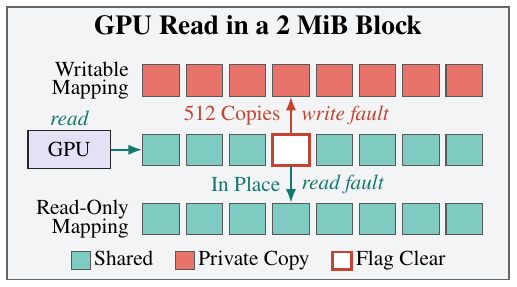 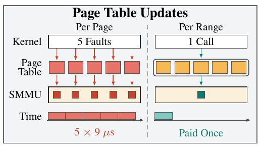 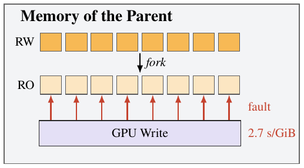</p>
<p align="center"><b>그림 1.</b> 호스트 페이지 테이블을 따라가는 GPU에서 copy-on-write가 부적합한 세 가지 이유. (a) accessed 플래그가 없는 페이지에 대한 GPU 읽기는 그 페이지가 속한 2 MiB 블록 전체에 대한 쓰기로 처리된다. (b) 소유권이 바뀌는 페이지마다 프로세스 전체의 무효화 비용이 든다. (c) <code>fork</code> 이후 다음 GPU 쓰기가 모든 페이지의 비용을 치른다.</p>

| 성질 | 측정값 |
|---|---|
| GPU는 accessed 플래그가 지워진 페이지에서 폴트를 내고, 드라이버는 쓰기 가능한 매핑의 폴트를 주변 2 MiB 블록 전체에 대한 쓰기로 처리한다 | 해당 페이지 1개가 512개 페이지를 사설 복사본으로 만든다. 블록마다 1개씩 있으면 객체 전체가 복사된다 |
| GPU를 사용하는 프로세스에서 단일 페이지 플러시는 주소 공간의 어느 위치에서든 약 9 us가 든다. 범위 연산에는 추가 비용이 없다 | copy-on-write 해제, 재사용 폴트, 페이지 단위 `mprotect`와 `MADV_DONTNEED`가 4.3~9.0배 느려진다 |
| `fork` 이후 fork 이전 메모리에 대한 다음 GPU 쓰기는 모든 페이지의 비용을 치른다 | GiB당 2.7초. `posix_spawn`이나 `MADV_DONTFORK`로 피할 수 있다 |

**GPU 수준의 공유.** CUDA IPC와 CUDA 가상 메모리 인터페이스는 한 MIG 인스턴스
안에서는 디바이스 메모리를 공유하지만 인스턴스 사이에서는 거부된다.

**MPS.** MPS 클라이언트 하나의 GPU 폴트는 같은 서버의 모든 클라이언트를
종료시킨다(18개 가운데 0개 생존). 시분할 프로세스와 다른 MIG 인스턴스의
프로세스는 영향을 받지 않는다(36개 가운데 36개 생존).

**프로세스 내부의 공유.** vLLM, SGLang, llama.cpp의 슬롯은 한 프로세스의 요청
사이에서 프리픽스를 공유한다. 이 공유는 프로세스 경계에서 끝난다.

### 2.4 선행 연구

| 연구 | 하는 일 | 다루지 않는 것 |
|---|---|---|
| "The Ingestion Tax" (arXiv 2608.12114) | 파일 기반 가중치를 제자리에서 읽고 N개 프로세스가 한 벌을 공유, Apple 하드웨어 | NVIDIA 통합 메모리 장치의 CUDA 엔진, 캐시 |
| llama.cpp PR #22120 | GB10에서 호스트 포인터 CUDA 버퍼, 측정 없이 종료 | 측정, 캐시 |
| Omni-Flow (arXiv 2606.31093) | 역할 프로세스들이 캐시 풀 한 벌을 공유, 디바이스 메모리, 단일 GPU | 호스트 페이지 테이블, GPU 파티션 경계 |
| SGLang 이슈 #35648 | 제안: CUDA IPC로 캐시 슬랩을 MPS 복제본에 내보냄 | 구현 |
| llama.cpp PR #21792 | 캐시 텐서를 `MAP_SHARED` 파일에 두고 메타데이터를 별도 파일로 저장 | GPU (CPU 전용) |
| vAttention (ASPLOS 2025) | 사용량을 따라가는 캐시 메모리, 디바이스 메모리 | 프로세스 간 공유 |
| MiaAI-Lab/Qwen3.8-Flash-Next-Single-DGX-Spark 이슈 #81 | 드라이버의 쓰기 의도 폴트 처리를 보고 | 증폭의 정량화, 설계 |
| vLLM, SGLang, llama.cpp 슬롯 | 한 프로세스 안의 요청 사이에서 프리픽스 공유 | 프로세스 경계 |

이 연구가 주장하지 않는 것은 가중치의 제자리 읽기, 불변 프리픽스와 사설 연속
영역의 배치, 사용량을 따라가는 캐시, 프로세스 간 캐시 공유 자체이다. 조사한
범위에서 주장하는 것은 계산된 프리픽스의 페이지를 호스트 페이지 테이블을 통해
여러 GPU 서빙 프로세스의 캐시 텐서에 매핑하는 것, 이를 GPU 파티션 사이에서
수행하는 것, 실행 중인 프로세스가 복사 없이 상태를 넘기는 것이다.

### 2.5 설계 요구사항

위 내용에서 다음 요구사항이 도출된다.

| 요구사항 | 근거 |
|---|---|
| 공유 상태는 읽기 전용으로 매핑한다 | 쓰기 가능한 매핑에서는 GPU 읽기가 복사를 일으킨다(2.3절) |
| 프로세스가 쓰는 내용은 처음부터 사설 메모리에 둔다 | 페이지 소유권이 바뀔 때마다 무효화 비용이 든다(2.3절) |
| 공유, 포크, 이동은 범위 연산으로 수행한다 | 범위 연산에는 추가 비용이 없다(2.3절) |
| 프로세스는 `fork`가 아니라 새로 실행한다 | `fork`는 이후의 GPU 쓰기에 비용을 남긴다(2.3절) |
| 공유 경로는 호스트 페이지 테이블이어야 한다 | GPU 수준 공유는 MIG 경계에서 거부되고, MPS는 장애를 전파한다(2.3절) |

## 3. 설계

### 3.1 설계 규칙과 전체 구조

설계 규칙은 2.5절의 요구사항을 하나로 묶은 것이다.

> 공유 상태는 불변이며 읽기 전용으로 매핑한다. 프로세스가 쓰는 내용은 처음부터
> 그 프로세스의 사설 메모리에 둔다. 공유, 포크, 이동은 매핑에 대한 범위
> 연산으로 수행하며, GPU가 접근하는 페이지의 소유권이 폴트를 통해 바뀌지
> 않는다.

<p align="center"></p>
<p align="center"><b>그림 2.</b> 전체 구조. 각 프로세스는 모델 파일과 게시된 프리픽스의 행을 읽기 전용으로 매핑하고, 자신이 쓰는 행을 사설 테일에 둔다. 두 MIG 인스턴스의 GPU는 호스트 페이지 테이블을 통해 이 메모리를 제자리에서 읽는다. (1) 게시, (2) 연결, (3) 테일 확장.</p>

그림 2는 세 층으로 구성된다. 위층은 두 MIG 인스턴스로 나뉜 GPU이다. 가운데
층은 서빙 프로세스의 주소 공간이며, 각 주소 공간은 가중치, 프리픽스의 행,
테일의 행으로 이루어진다. 아래층은 호스트 물리 메모리이다. 가중치 영역과
프리픽스 영역의 매핑은 읽기 전용이고 모든 프로세스가 같은 물리 페이지를
가리킨다. 테일 영역의 매핑은 쓰기 가능하며 프로세스마다 다른 페이지를
가리킨다. 프로세스 사이의 공유가 호스트 페이지 테이블에서 이루어지므로 두
MIG 인스턴스의 프로세스가 같은 페이지를 공유한다.

### 3.2 가중치 in-place

CUDA 백엔드가 호스트 매핑을 버퍼로 받도록 한다(`GGML_CUDA_HOST_PTR=1`). 엔진은
모델 파일을 공유 읽기 전용으로 매핑하여 가중치 버퍼로 사용한다. 읽기 전용
매핑은 GPU 읽기에 의해 사설 복사본으로 바뀌지 않는다. GPU는 accessed 플래그를
설정하지 못하므로, 로드할 때 CPU가 파일 전체를 한 번 읽어 플래그를 설정한다.
이 과정이 없으면 첫 커널이 모든 페이지에서 폴트를 낸다. 모델을 2 MiB 페이지
(`huge=always`로 마운트한 tmpfs 또는 hugetlbfs)에 두면 작은 페이지의 비용이
없어진다. 행 길이가 512의 배수가 아닌 양자화 텐서는 거부한다. 읽기 전용
매핑에는 행 패딩을 둘 공간이 없기 때문이다.

### 3.3 KV 캐시 익스텐트

캐시의 셀은 한 번 기록되고 순서대로 채워진다(2.2절). flash attention과 단일
스트림을 사용할 때 셀은 모든 키 텐서와 값 텐서의 한 행이다. 따라서 공통
프리픽스의 셀은 모든 텐서의 앞부분 범위가 되고, 에이전트가 추가하는 내용은 그
뒤에 놓인다(그림 3).

<p align="center"></p>
<p align="center"><b>그림 3.</b> 캐시의 키 또는 값 텐서 하나를 익스텐트로 구성한 모습. 프리픽스의 행은 게시자의 파일에서 읽기 전용으로 매핑되어 모든 에이전트에서 같은 물리 페이지이다. 에이전트가 쓰는 행은 CPU가 GPU보다 앞서 채워 두는 사설 메모리에 놓인다.</p>

- **게시(publish).** 게시자의 캐시는 tmpfs의 파일이다. 컨텍스트의 상태를
  저장하면 셀의 메타데이터(셀당 16바이트)만 기록되고 행은 기록되지 않는다.
  사용 중인 행은 텐서마다 `mprotect` 한 번으로 게시자 자신에게도 읽기 전용이
  되고, 해당 셀은 동결된다.
- **연결(attach).** 에이전트는 프리픽스 행의 온전한 페이지를 파일에서 사설
  읽기 전용으로 각 텐서의 시작 위치에 매핑한다. 일부만 채워진 마지막 페이지는
  복사하고, 텐서의 나머지는 사설 메모리로 둔다. CPU가 매핑한 페이지를 한 번
  읽어 accessed 플래그를 설정한다. 상태 파일을 읽으면 메타데이터가 복원되며
  행은 읽지 않는다.
- **동결 셀.** 캐시는 동결된 셀을 다시 내주지 않는다. 에이전트가 프리픽스의
  토큰을 버리거나 다시 쓰면 새 셀은 자신의 테일에 놓인다. 매핑이 읽기
  전용이므로 이를 통한 쓰기는 시도한 프로세스의 폴트가 된다.
- **사용량을 따라가는 테일.** 사설 영역은 메모리 없이 시작한다. 디바이스가
  배치의 셀을 쓰기 전에 CPU가 해당 행의 페이지를 256행 앞서 채운다. 비어 있는
  페이지를 채우는 데에는 무효화가 필요하지 않다.
- **포크(fork).** 상태를 저장한 게시자는 계속 실행된다. 게시자의 다음 셀은
  동결된 셀 뒤에 놓인다. 자식은 에이전트로 연결한다.
- **이동(move).** 게시하고, 다른 프로세스에서 연결한 뒤, 게시자를 종료한다.
  파일은 그것을 채운 프로세스가 종료된 뒤에도 유지된다.

이 동작은 모두 호스트 매핑이므로 두 MIG 인스턴스 사이에서도 성립한다.

<p align="center"></p>
<p align="center"><b>그림 4.</b> 매핑에 대한 연산으로서의 게시와 연결. 포크는 게시자가 계속 실행되는 경우이고, 이동은 게시자가 종료되는 경우이다.</p>

### 3.4 익스텐트 체인

에이전트는 트리를 이룬다. 루트가 공통 프리픽스를 계산하고, 그룹 리더가 그룹의
문맥을 덧붙이며, 리프가 각자의 작업을 덧붙인다. 한 단계의 익스텐트에서는
프리픽스에 연결한 리더가 자신이 덧붙인 행을 넘기지 못하므로, 리프는 공통
프리픽스만 공유하고 그룹 문맥을 다시 계산해야 한다. 익스텐트 체인은 배치를 두
개의 익스텐트에서 조상마다 세그먼트 하나를 두는 사슬로 확장한다(그림 5).

- **덧붙인 행의 게시.** 게시하려는 에이전트는 사설 익스텐트를 익명 메모리가
  아닌 자신의 세그먼트 파일에 둔다. 게시할 때 덧붙인 행을 동결하고 메타데이터만
  담은 상태 파일을 쓴다.
- **사슬에 연결.** 후손은 파일 목록과 각 세그먼트가 끝나는 행을 받는다. 텐서마다
  각 세그먼트의 온전한 페이지를 해당 파일에서 읽기 전용으로 매핑하고, 두
  세그먼트가 만나는 페이지는 복사한다.
- **세그먼트의 수명.** 세그먼트의 페이지는 파일에 속하고 커널이 매핑 수를 센다.
  공유하는 프로세스가 모두 연결한 뒤에는 파일 이름을 지워도 되며, 마지막
  프로세스가 매핑을 해제하거나 종료할 때 메모리가 반환된다. 공유자를 추적하는
  별도 프로세스는 없다.

<p align="center">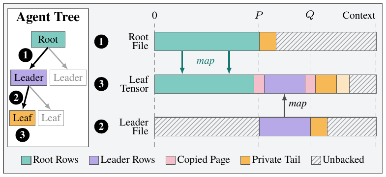</p>
<p align="center"><b>그림 5.</b> 에이전트 트리와 리프 텐서 하나의 익스텐트 체인. (1) 루트가 공통 프리픽스를 게시한다. (2) 리더가 덧붙인 행을 게시한다. (3) 리프가 두 세그먼트에 연결한다.</p>

### 3.5 구현

| 구성 요소 | 위치 |
|---|---|
| 가중치 in-place | `inplace_weights.patch`: `ggml-cuda.cu`에 59줄 추가. 클론 `llama.cpp/` |
| 캐시 익스텐트 | `kv_extents.patch`: 위 변경에 더해 `ggml-cuda.cu` 30줄, `llama-kv-cache.cpp` 397줄, 헤더 3줄. 클론 `llama.cpp-kv/` |
| 디바이스 메모리 방식(비교용) | `kv_vmm.patch`: 위 변경에 더해 CUDA 가상 메모리 인터페이스의 2 MiB 할당으로 구성한 캐시. 클론 `llama.cpp-vmm/` |

계산 그래프는 바꾸지 않는다. 동작 방식은 프로세스의 환경 변수로 선택하며(7절),
환경 변수가 없으면 엔진은 원본과 같이 동작한다.

## 4. 평가

모델은 Qwen2.5-7B-Instruct Q4_K_M(4.36 GiB)이다. 셀마다 6회 반복하였고, 실행
순서를 번갈아 바꾸었으며, 두 인스턴스가 관여하는 실험에서는 역할을 번갈아
바꾸었다. 비율은 같은 반복 안에서 짝지어 계산하고 95% 신뢰구간을 붙였다.
통과 기준은 캠페인을 실행하기 전에 러너에 기록하였고, 러너는 해시로 고정된다.
`verify_llm_share_artifact.sh`는 GPU 없이 모든 요약을 원시 로그에서 다시
계산하고 아래의 관계를 다시 평가한다.

### 4.1 가중치 in-place (기록 3~5절)

<p align="center"></p>
<p align="center"><b>그림 6.</b> 가중치 in-place. 왼쪽: 두 MIG 인스턴스에 번갈아 배치한 서빙 프로세스 N개의 메모리. 오른쪽: 매핑한 모델의 페이지 크기에 따른 생성 속도(디바이스 복사 대비).</p>

| 가중치 | 디바이스 복사 대비 생성 속도 | 로드 (ms) | 모델 파일 외 메모리 (MiB) |
|---|---|---:|---:|
| 디바이스 복사 (기존 엔진) | 1.000 | 943 | 5,423 |
| in-place, 4 KiB 페이지 캐시 | 0.943 [0.918, 0.969] | 516 | 878 |
| in-place, 2 MiB 페이지 (tmpfs) | 0.997 [0.971, 1.025] | 270 | 측정하지 않음 |

생성 텍스트는 동일하다. 프로세스 8개는 40.8 GiB 대신 10.0 GiB를 차지하며, 이
값은 MIG, 시분할, MPS에서 같다. 어댑터 4개를 쓰는 프로세스 5개는 27.6 GiB 대신
9.9 GiB를 차지하고, 디바이스 복사를 쓴 경우와 같은 텍스트를 생성한다(30개
가운데 30개).

### 4.2 게시된 프리픽스 위의 에이전트 (기록 6.4절)

게시자가 프리픽스를 계산하고 종료한다. 에이전트 프로세스 1, 4, 8개가 각자의
작업을 덧붙여 프리픽스를 이어 간다. 에이전트는 하나씩 번갈아 다른 MIG
인스턴스에 배치하였다.

<p align="center"></p>
<p align="center"><b>그림 7.</b> 게시된 프리픽스 하나 위에 있는 에이전트들의 메모리. 캐시 파일(0.2 GiB와 0.9 GiB)은 한 번만 존재하며 포함하지 않았다.</p>
<p align="center"></p>
<p align="center"><b>그림 8.</b> 프리픽스를 넘기는 시간, 연결하는 시간, 프로세스 시작 후 첫 토큰까지의 시간.</p>

| 16,321토큰 프리픽스 | 상태 파일 복사 (기존 엔진) | 익스텐트, 테일 전체 할당 | 익스텐트, 사용량을 따라가는 테일 |
|---|---:|---:|---:|
| 넘기는 시간 (ms) / 상태 파일 (MiB) | 561 / 893 | 9 / 0.25 | 9 / 0.25 |
| 연결, 에이전트 1 / 4 / 8개 (ms) | 225 / 396 / 484 | 70 / 93 / 92 | 43 / 57 / 65 |
| 프로세스 시작 후 첫 토큰, 에이전트 1 / 8개 (ms) | 964 / 2,205 | 845 / 1,774 | 791 / 1,778 |
| 에이전트 8개의 메모리 (GiB) | 19.9 | 12.7 | 5.7 |
| 에이전트 8개가 매핑한 프리픽스 페이지: 상주 합계 / 비례 몫 (MiB) | - | 7,140 / 1,025 | 7,140 / 908 |
| 복사와 텍스트가 같은 에이전트 | 기준 | 78개 가운데 78개 | 78개 가운데 78개 |

4,081토큰 프리픽스에서는 넘기는 시간이 231 ms에서 3 ms로 줄고, 에이전트 8개의
메모리는 9.0, 7.1, 5.5 GiB이다. 첫 토큰까지의 시간은 4~23%만 줄어든다. 모델
로드가 이 시간의 대부분을 차지하기 때문이다. 이 메커니즘의 이득은 메모리에
있다.

### 4.3 copy-on-write와의 비교 (기록 6.7절)

에이전트 8개가 게시자 캐시 파일의 쓰기 가능한 사설 매핑을 통해 16,321토큰
프리픽스를 얻는 경우이다.

<p align="center"></p>
<p align="center"><b>그림 9.</b> 익스텐트와 copy-on-write 매핑의 비교. 16,321토큰 프리픽스 위의 에이전트 8개.</p>

| 방식 | 메모리 (GiB) | 첫 토큰 (초) | 에이전트 자신의 작업 디코딩 (초) |
|---|---:|---:|---:|
| 익스텐트 | 5.6 | 1.7 | 0.32 |
| copy-on-write, 2 MiB 파일, CPU 읽기 수행 | 6.5 | 2.0 | 0.60 |
| copy-on-write, 4 KiB 파일, CPU 읽기 수행 | 6.6 | 3.9 | 2.5 |
| copy-on-write, CPU 읽기 없음 (두 페이지 크기 모두) | 12.7 | 4.9~5.2 | 3.5~3.7 |

CPU 읽기가 없으면 매핑은 읽기에서 복사를 일으킨다. 에이전트는 프리픽스에 쓰지
않는데도 프리픽스 전체의 사설 복사본을 갖게 된다. 모든 보완 조치를 적용한
copy-on-write는 익스텐트에 근접한다. 그러나 copy-on-write에는 오류 없이 공유가
사라지는 상태가 있고, 익스텐트에는 그런 상태가 없다.

### 4.4 실행 중인 부모의 포크 (기록 6.5절)

부모가 4,081토큰 프리픽스를 자식 4개에 넘기고, 자식이 생성하는 동안 자신도
이어서 생성한다. 자식 가운데 2개는 다른 MIG 인스턴스에 있다. 부모의 정지
시간은 218 ms에서 3 ms로 줄고, 부모는 6회 모두 단독으로 계산한 프로세스와 같은
텍스트를 생성한다. 모든 자식은 복사로 상태를 받은 자식과 같은 텍스트를
생성한다(24개 가운데 24개). 자식들의 메모리는 4.4 GiB에서 2.8 GiB로 줄어든다.

### 4.5 생성 속도 (기록 6.8절)

프로세스 1개에서 캐시를 호스트 메모리에 둔 경우와 디바이스 메모리에 둔 경우를
비교하였다.

<p align="center"></p>
<p align="center"><b>그림 10.</b> 캐시를 호스트 메모리에 둔 경우의 생성 속도(캐시를 디바이스 메모리에 둔 경우 대비).</p>

| MIG 인스턴스 | 4,081토큰 프리픽스 | 16,321토큰 프리픽스 |
|---|---|---|
| 12-SM | 0.996 [0.992, 0.999] | 1.002 [0.997, 1.006] |
| 6-SM | 0.976 [0.974, 0.979] | 0.942 [0.940, 0.945] |

아무것도 공유하지 않는 사설 호스트 메모리 캐시도 6-SM 인스턴스에서 같은 폭으로
느려진다. 따라서 이 비용은 매핑이 아니라 6-SM 인스턴스의 호스트 메모리 접근에서
발생한다. GPU 내부의 원인은 찾지 못하였다. 12-SM 인스턴스에서 시분할되는
프로세스 2개의 속도는 1.002이다.

### 4.6 프로세스 내부 공유와의 비교 (기록 6.10절)

16,321토큰 프리픽스 위의 에이전트 8개가 각각 64토큰을 생성한다.

<p align="center"></p>
<p align="center"><b>그림 11.</b> 메모리 대비 처리량. 원: 프로세스 8개. 사각형: 배칭 서버 1개. 삼각형: MIG 인스턴스마다 배칭 서버 1개. 익스텐트를 쓰는 프로세스 8개의 메모리에는 캐시 파일이 포함된다.</p>

| 구성 | 생성 (tokens/s) | 메모리 (GiB) | 전체 에이전트 준비 (초) |
|---|---:|---:|---:|
| 프로세스 8개, 각자 프리픽스 복사 | 35.0 | 19.9 | - |
| 프로세스 8개, 익스텐트 | 34.4 | 5.7 (캐시 파일 포함 6.6) | - |
| 배칭 서버 1개, 시퀀스 8개 | 75.6 | 2.5 | 20.7 |
| MIG 인스턴스마다 서버 1개, 각자 프리픽스 계산 | 106.2 | 5.0 | 30.6 |
| MIG 인스턴스마다 서버 1개, 둘째 서버가 복사 | 105.0 | 5.0 | 22.2 |
| MIG 인스턴스마다 서버 1개, 둘째 서버가 프리픽스 매핑 | 102.9 | 2.4 | 21.4 |

### 4.7 디바이스 메모리 공유와의 비교 (기록 6.9절)

가장 가까운 선행 설계는 프로세스 사이에서 캐시를 디바이스 메모리로 공유한다.
`kv_vmm.patch`는 이 방식을 같은 엔진에 기준선으로 구현한 것이다. 캐시는 CUDA
가상 메모리 인터페이스의 2 MiB 할당으로 구성되고, 자식은 프리픽스가 채운
할당을 읽기 전용으로 매핑한다. 아래는 한 MIG 인스턴스 안의 부모 1개와 자식
4개, 16,321토큰 프리픽스의 결과이다(12-SM / 6-SM 인스턴스).

<p align="center"></p>
<p align="center"><b>그림 12.</b> 호스트 익스텐트, 공유 디바이스 메모리 캐시, 복사의 비교.</p>

| | 복사 (기존 엔진) | 디바이스 메모리 캐시 | 호스트 익스텐트 |
|---|---:|---:|---:|
| 부모의 정지 시간 (ms) | 551 / 571 | 41 / 39 | 8 / 9 |
| 자식의 연결 시간 (ms) | 501 / 524 | 438 / 435 | 48 / 49 |
| 자식의 첫 토큰 (초) | 1.88 / 2.00 | 1.84 / 1.92 | 1.43 / 1.55 |
| 자식 4개의 메모리 (GiB) | 9.9 / 9.9 | 3.9 / 3.8 | 3.0 / 3.0 |
| 자식의 생성 속도 (복사 대비) | 1.00 | 1.01 / 1.00 | 0.98 / 0.92 |
| 복사와 텍스트가 같은 자식 | 기준 | 12개 가운데 12개 | 12개 가운데 12개 |
| 다른 MIG 인스턴스의 자식 | 복사 | 거부 (12회 가운데 0회) | 실행 (12회 가운데 12회) |

한 인스턴스 안에서는 두 방식이 모두 동작한다. 디바이스 메모리 방식은 디바이스
메모리의 생성 속도를 유지한다. 호스트 익스텐트는 연결이 약 10배 빠르고,
메모리를 약 5분의 1 적게 쓰며, 살아 있는 내보내기 프로세스 대신 파일 경로만
필요하고, 둘 가운데 다른 인스턴스에 도달하는 유일한 방식이다.

### 4.8 격리와 배치 (기록 4, 5절)

- MPS 클라이언트 하나의 GPU 폴트는 같은 서버의 다른 클라이언트를 종료시키고
  (18개 가운데 0개 생존) 그 밖의 프로세스에는 영향을 주지 않는다(36개 가운데
  36개). 메모리 공유는 MIG, 시분할, MPS에서 같다.
- 프로세스를 분리해도 처리량은 늘지 않는다. MIG 인스턴스 하나의 합계는 공유하는
  프로세스 수와 무관하게 25~29 tokens/s이다.
- 각 MIG 인스턴스는 매번 같은 캐시 비트를 계산하지만, 두 인스턴스가 같은 비트를
  계산한 경우는 없다(6회 가운데 0회). 다른 인스턴스의 프리픽스를 이어 가는
  에이전트는 그 상태를 복사한 에이전트와 같은 텍스트를 생성하며, 자신의
  인스턴스에서 다시 계산한 텍스트와는 다를 수 있다.

### 4.9 통과하지 못한 사전 기준

| 캠페인 전에 정한 기준 | 결과 |
|---|---|
| 모든 에이전트가 프리픽스를 다시 계산한 에이전트와 같은 텍스트를 생성한다 | 다른 MIG 인스턴스의 에이전트에서 통과하지 못하였다(4,081토큰에서 36개 가운데 12개, 16,321토큰에서 36개 가운데 24개 일치). 기존 엔진의 복사도 같다. 게시자의 인스턴스에서는 통과하고(42개 가운데 42개), 복사 대비로는 통과한다(78개 가운데 78개). 원인은 두 인스턴스의 비트 차이이다 |
| 익스텐트가 복사의 생성 속도의 97%를 유지한다 | 6개 셀 가운데 2개에서 통과하지 못하였다(0.955, 0.970). 원인은 6-SM 인스턴스에서 호스트 메모리의 비용이다 |
| 기존 서버에서 익스텐트의 모든 응답이 복사와 같다 | 첫 캠페인에서 통과하지 못하였다(72개 가운데 36개). 프리픽스를 토큰 안쪽에서 게시한 것이 원인이며, 토큰 경계에서 게시한 두 번째 캠페인에서는 72개가 모두 같다(4.10절) |
| 에이전트 32개에서 익스텐트의 처리량이 복사의 92% 이상이다 | 6회 전체로는 통과하지 못하였다(0.860). 1회차에 복사 쪽이 메모리 할당에서 240초 대기한 것이 원인이며, 나머지 5회는 0.948~1.000이다 |
| 한 단계 익스텐트의 리프도 복사와 같은 텍스트를 생성한다 | 통과하지 못하였다(48개 가운데 42개). 리프가 그룹 문맥을 자신의 MIG 인스턴스에서 다시 계산하기 때문이다. 익스텐트 체인은 48개가 모두 같다 |

### 4.10 추가 캠페인 (기록 6.11~6.12절)

추가 캠페인 14개는 GPU 공유 방식, 한 엔진 안의 기준선 메커니즘, 에이전트 트리,
에이전트 수와 모델, 기존 서버, 메모리 한도, 그리고 세 가지 탐침을 다룬다. 모두
셀당 6회 반복하였고, `verify_stator_campaigns.sh`가 요약을 원시 로그에서 다시
계산하고 사전 기준을 다시 평가한다. 메모리는 MiB를 1024로 나눈 GiB이다.

**GPU 공유 방식.** 부모 하나가 16,321토큰 프리픽스를 자식 8개에 넘기고 함께
생성한다. 익스텐트는 네 구성 모두에서 실패 없이 동작한다.

| 구성 | 자식의 메모리: 복사 → 익스텐트 (GiB) | 처리량 비 (익스텐트/복사) |
|---|---:|---:|
| 시분할 (12-SM 인스턴스) | 19.8 → 5.8 | 0.993 |
| MPS (12-SM 인스턴스) | 19.8 → 5.7 | 0.996 |
| MIG (두 인스턴스에 번갈아 배치) | 19.7 → 5.9 | 0.972 |
| MIG + 인스턴스마다 MPS | 19.7 → 5.7 | 0.965 |

부모의 정지 시간은 528~557 ms에서 8.7~9.2 ms로, 자식의 연결 시간은 454~576
ms에서 51~56 ms로 줄어든다. 익스텐트 자식 576개는 모두 복사와 같은 텍스트를
생성한다.

<p align="center">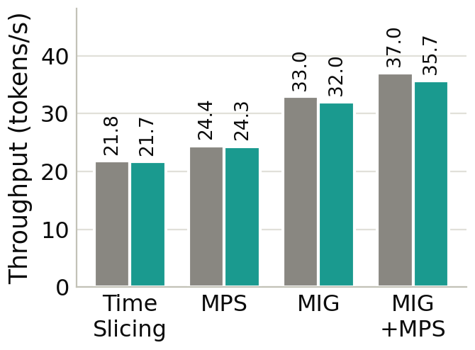 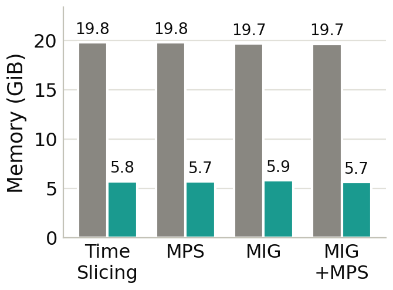</p>
<p align="center"><b>그림 13.</b> GPU 공유 방식에 따른 자식 8개의 처리량과 메모리.</p>

**한 엔진 안의 다섯 방식.** 선행 시스템은 이 장치에서 실행되지 않거나 코드가
공개되지 않았으므로, 각 시스템이 프리픽스를 넘기는 방식을 같은 엔진
(`llama.cpp-sota`)에 구현하여 비교하였다. 부모 하나와 자식 8개, 16,321토큰
프리픽스이다.

| 방식 | 대응하는 연구 | 메모리 (GiB) | 부모 정지 (ms) | 연결 (ms) | 첫 토큰 (s) | MIG 간 배치에서 완료한 자식 |
|---|---|---:|---:|---:|---:|---:|
| Copy | llama.cpp, LMCache 계열 저장소 | 19.8 | 540 | 549 | 2.67 | 48/48 |
| Demand | vAttention (사용량을 따라가는 디바이스 메모리) | 13.9 | 543 | 597 | 2.72 | 48/48 |
| Device | Omni-Flow, Liu 외 (디바이스 메모리 공유) | 7.6 | 41 | 770 | 2.86 | 24/48 |
| CoW Map | 커널의 copy-on-write 매핑(복사가 아니라 사설 쓰기 가능 매핑이며, 에이전트가 쓰는 페이지만 그때 복사된다) | 6.7 | 8 | 50 | 2.77 | 48/48 |
| STATOR | 익스텐트 | 5.9 | 8 | 49 | 2.14 | 48/48 |

메모리, 정지, 연결, 첫 토큰은 모든 프로세스가 12-SM 인스턴스에 있는 경우의
값이다. 자식을 두 인스턴스에 번갈아 배치하면 Device는 다른 인스턴스의 자식 24개
모두에서 가져오기가 거부된다. CoW Map도 정지와 연결이 짧고 MIG 경계를 넘지만, 첫
쓰기에서 폴트를 치르므로 메모리가 더 크고 첫 토큰이 늦다. Device의 연결 시간은
이 연구의 구현에 따른 값이다(아래 탐침 참조).

<p align="center">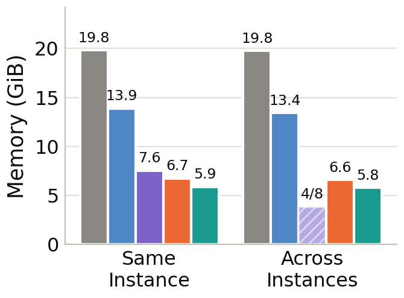 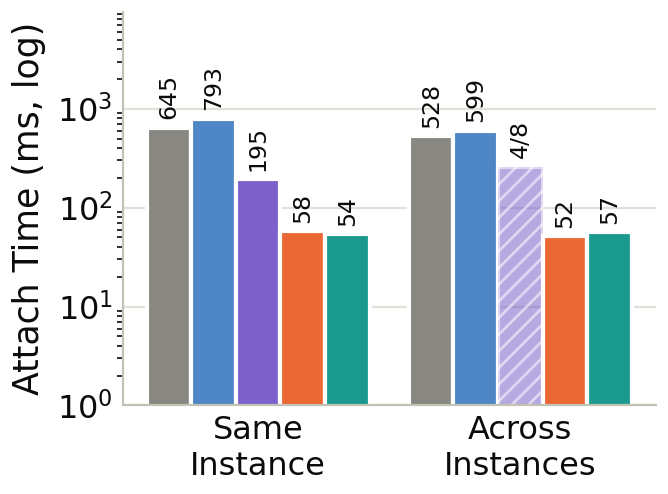 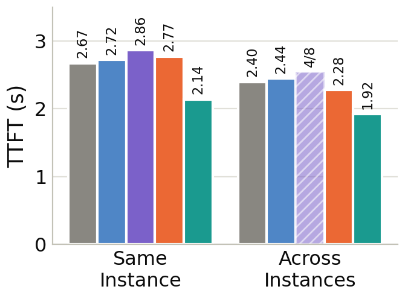 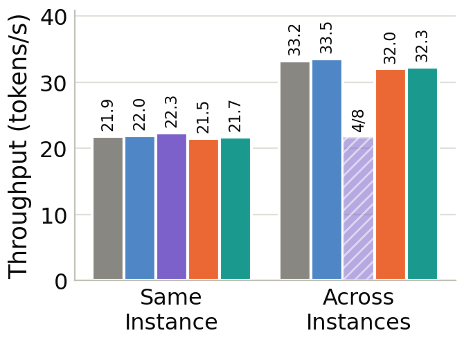</p>
<p align="center"><b>그림 14.</b> 한 엔진 안의 다섯 방식. 회색: Copy, 파랑: Demand, 보라: Device, 주황: CoW Map, 청록: STATOR. 빗금은 일부 자식만 완료한 경우이다.</p>

**에이전트 트리.** 루트 하나, 리더 둘, 리더마다 리프 넷으로 이루어진 프로세스
11개이다. 리더는 그룹 문맥 1,473토큰을 덧붙여 다시 게시한다.

| 방식 | 트리의 메모리 (GiB) | 리더의 정지 (ms) | 리프의 첫 토큰 (s) | 복사와 같은 리프 텍스트 |
|---|---:|---:|---:|---:|
| 복사 | 27.3 | 604 | 2.89 | 기준 |
| 한 단계 익스텐트 (리프가 그룹 문맥을 다시 계산) | 9.6 | 게시하지 않음 | 18.88 | 42/48 |
| 익스텐트 체인 | 9.2 | 6.2 | 2.25 | 48/48 |
| 익스텐트 체인, 리더 파일은 4 KiB 페이지 | 9.0 | 11.1 | 2.35 | 48/48 |

모든 프로세스가 연결한 뒤 파일 이름을 지워도 6회 모두 끝까지 실행되었고, 마지막
프로세스가 종료한 뒤 tmpfs에 남은 페이지가 없었다.

<p align="center">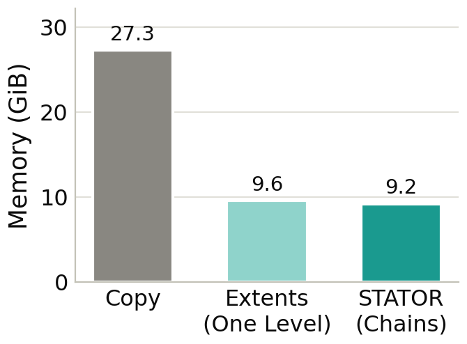 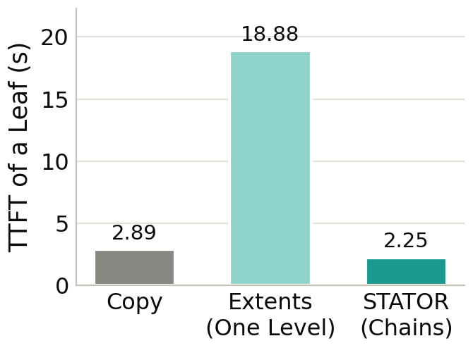</p>
<p align="center"><b>그림 15.</b> 에이전트 트리의 메모리와 리프의 첫 토큰 시간.</p>

**에이전트 수, 모델, 워크로드.**

| 실험 | 에이전트의 메모리: 복사 → 익스텐트 (GiB) | 캐시 파일 (GiB) | 처리량 비 |
|---|---:|---:|---:|
| Qwen2.5-7B, 에이전트 8개 | 19.9 → 5.7 | 0.9 | 0.986 |
| Qwen2.5-7B, 에이전트 16개 | 39.6 → 11.4 | 0.9 | 0.986 |
| Qwen2.5-7B, 에이전트 32개 | 78.8 → 22.7 | 0.9 | 0.860 (아래 참조) |
| Llama-3.1-8B, 에이전트 8개 | 37.8 → 5.5 | 2.0 | 0.979 |
| Qwen2.5-14B, 에이전트 8개 | 54.5 → 6.1 | 3.0 | 0.960 |
| 에이전트 워크로드 (시스템 프롬프트, 도구 설명, 문서; 14,282토큰) | 19.8 → 5.8 | 0.8 | 0.990 |

에이전트 하나가 추가될 때 복사는 2.5 GiB, 익스텐트는 0.7 GiB가 늘어난다. 캐시
파일을 포함한 절감 배수는 세 모델에서 3.0배, 5.0배, 6.0배이다. 32개 셀의 처리량
비 0.860은 1회차에 복사 쪽 에이전트가 메모리 79 GiB를 할당하면서 최대 240초
대기한 결과이다. 생성 시점이 흩어져 복사 쪽 속도 합이 부풀려졌다. 나머지 5회의
비는 0.948~1.000이다. 익스텐트 에이전트 480개는 모두 복사와 같은 텍스트를
생성한다.

<p align="center">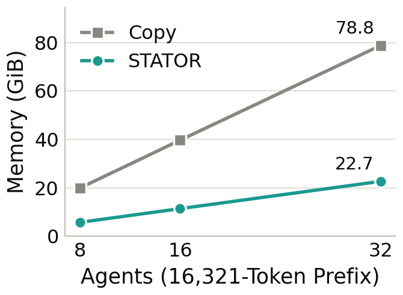 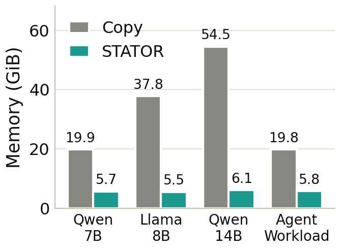</p>
<p align="center"><b>그림 16.</b> 에이전트 수, 모델, 워크로드에 따른 메모리.</p>

**기존 서버.** 코드를 수정하지 않은 `llama-server`의 슬롯 저장·복원 요청으로
프리픽스를 넘겼다(에이전트 워크로드, 에이전트 서버 8개).

| 항목 | 복사 | 익스텐트 |
|---|---:|---:|
| 슬롯 저장 | 505 ms, 781 MiB | 9.6 ms, 0.22 MiB |
| 슬롯 복원 | 518 ms | 265 ms |
| 요청의 첫 토큰 | 894 ms | 686 ms |
| 에이전트 서버 8개의 메모리 | 18.8 GiB | 4.8 GiB |
| 복사와 같은 응답 | 기준 | 72/72 |

응답이 복사와 같으려면 프리픽스를 토큰 경계에서 게시해야 한다. 첫 캠페인에서는
게시한 프리픽스의 마지막 문자가 작업의 첫 문자들과 한 토큰으로 묶였다. 서버가
이 토큰을 다시 평가하였고, 동결된 셀에는 쓸 수 없으므로 그 토큰이 사설 테일에
놓여 캐시 배치가 복사와 달라졌다. 그 결과 응답 72개 가운데 36개만 복사와
같았다. 프리픽스를 작업 앞의 줄바꿈까지 포함해 게시한 두 번째 캠페인에서는 72개가
모두 같다.

<p align="center">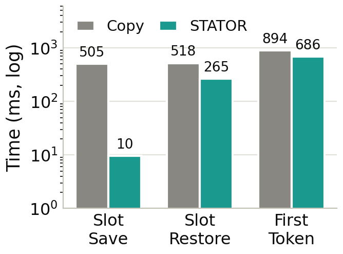 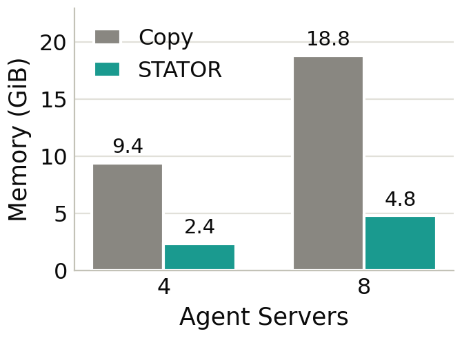</p>
<p align="center"><b>그림 17.</b> 기존 서버에서의 슬롯 저장, 복원, 첫 토큰 시간과 에이전트 서버의 메모리.</p>

**에이전트별 메모리 한도.** 에이전트 4개를 각자의 cgroup에 두었다. 커널은 호스트
메모리만 cgroup에 계상하고 디바이스 메모리는 계상하지 않는다.

| 항목 | 복사 | 익스텐트 |
|---|---:|---:|
| 에이전트 4개가 차지한 메모리 | 9.9 GiB | 2.8 GiB |
| 그 가운데 cgroup에 계상된 양 | 1.2 GiB | 1.3 GiB |
| 한도 435 MiB에서 4,097토큰 작업을 받은 에이전트 | 6회 모두 완료 (최대 계상 320 MiB) | 6회 모두 자신의 cgroup에서 종료 |
| 같은 한도의 다른 에이전트 3개 | 18/18 완료 | 18/18 완료, 텍스트 동일 |

익스텐트는 테일을 CPU에서 미리 채우므로 한도가 GPU 폴트가 아니라 프로세스의
채우기 호출에서 적용된다. 복사에서는 캐시가 디바이스 메모리이므로 한도가
적용되지 않는다.

<p align="center">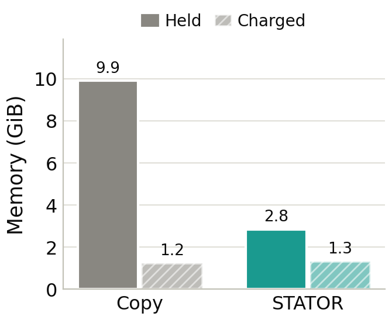 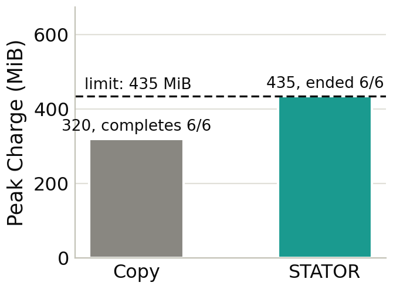</p>
<p align="center"><b>그림 18.</b> cgroup에 계상되는 메모리와 한도 아래에서의 동작.</p>

**탐침.**

| 탐침 | 결과 |
|---|---|
| 읽기 경로 | 1 GiB 버퍼를 훑는 커널의 대역폭은 호스트 메모리와 디바이스 메모리가 같다(비 1.000~1.004, 12-SM에서 68 GiB/s, 6-SM에서 46 GiB/s). 6-SM 인스턴스의 생성 속도 손실은 읽기 경로로 설명되지 않으며 원인은 확인하지 못하였다 |
| 디바이스 메모리 연결 비용 | 896 MiB를 다른 프로세스가 가져와 매핑하는 데 2 MiB 할당 448개로는 25.0 ms, 할당 1개로는 1.5 ms가 든다. 엔진의 Device 기준선이 보인 연결 시간(438~770 ms)은 대부분 이 연구의 구현에서 생긴 것이며 인터페이스의 비용이 아니다 |
| 쓰기 보호 | 호스트 매핑에서는 GPU 쓰기가 12회 모두 쓰는 프로세스에서 실패하고 파일 내용이 유지된다. CUDA 가상 메모리 인터페이스에서는 가져간 프로세스가 자신의 매핑을 쓰기 가능으로 바꿔 6회 모두 덮어쓰고, 내보낸 프로세스가 바뀐 내용을 읽는다 |

<p align="center">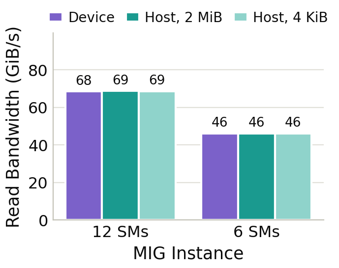 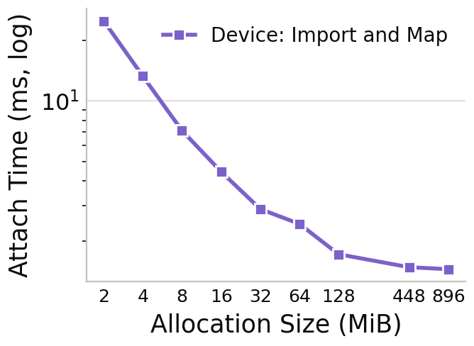 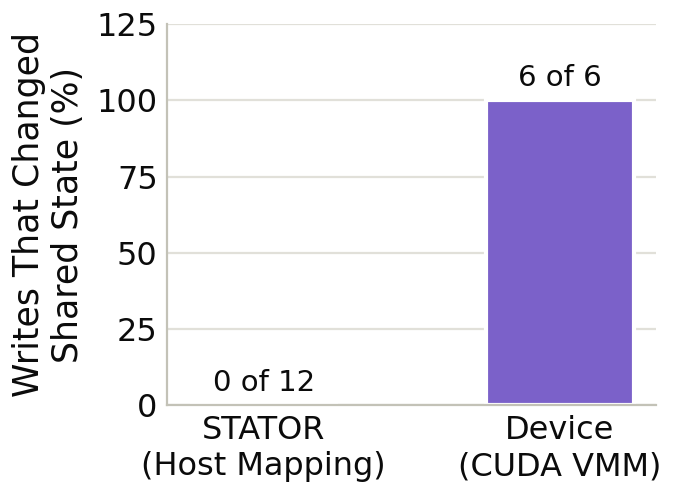</p>
<p align="center"><b>그림 19.</b> 메모리 종류별 읽기 대역폭, 할당 크기별 디바이스 메모리 연결 비용, GPU 쓰기가 공유 상태를 바꾼 비율.</p>

**Ollama.** 배포용 서빙 시스템인 Ollama 0.16.1을 별도 인스턴스로 실행하였다.
MIG 인스턴스 식별자를 러너에 전달하는 호환 라이브러리(`ollama_mig_visible.c`)를
미리 적재한 것 외에는 수정하지 않았다. 에이전트 8개가 16,321토큰 프리픽스를
공유한다.

| 구성 | 첫 요청의 첫 토큰 (s) | 재요청의 첫 토큰 (s) | 메모리 (GiB) | 처리량 (tokens/s) |
|---|---:|---:|---:|---:|
| 서버 1개, 슬롯 8개 | 192 | 0.89 | 19.5 | 33.0 |
| MIG 인스턴스마다 서버 1개, 슬롯 4개씩 | 121 | 0.73 | 24.5 | 47.5 |

Ollama는 슬롯마다 프리픽스를 따로 계산하고 서버 사이에서 공유하지 않는다. 메모리는
가중치의 디바이스 복사와 모든 슬롯의 컨텍스트를 포함한다.

<p align="center">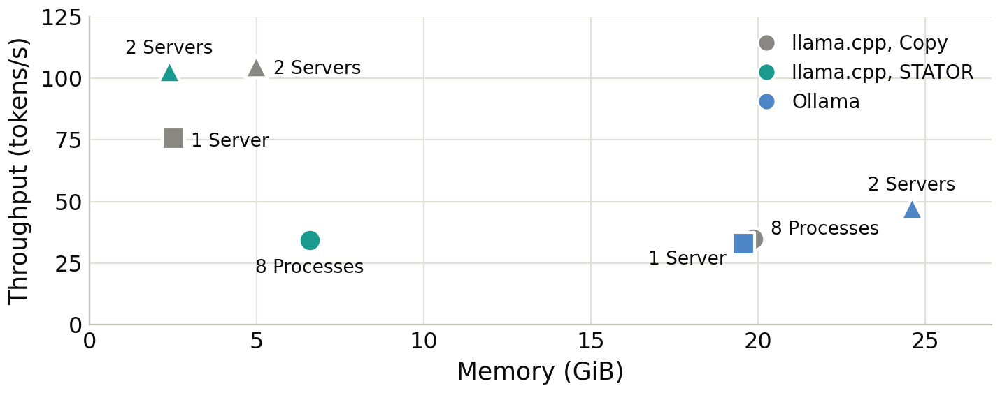</p>
<p align="center"><b>그림 20.</b> 에이전트 8개의 처리량과 메모리. 원: 프로세스 8개, 사각형: 서버 1개, 삼각형: MIG 인스턴스마다 서버 1개.</p>

### 4.11 보강 캠페인 (2026-10-07, 기록 6.14절)

앞 절까지의 비교는 대부분 가중치를 양쪽 모두 in-place로 둔 상태에서 KV 캐시만
비교하였다. 이 절은 수정하지 않은 엔진 전체와의 비교, 조정한 기준선, 구성 요소별
기여, 결함 격리, 실제 파이프라인을 다룬다. 모두 셀당 6회 반복이다.

**전체 스택의 메모리와 수용 한계.** 에이전트가 무엇을 공유하는지에 따라 네 스택을
비교한다. `무수정`은 패치를 적용하지 않은 같은 커밋의 엔진으로, 에이전트마다
가중치를 디바이스 메모리에 복사하고 프리픽스를 상태 파일에서 복사한다. `KV 공유`와
`가중치 공유`는 두 메커니즘 중 하나만 적용하고, STATOR는 둘 다 적용한다. 에이전트
워크로드(프리픽스 14,282토큰, 컨텍스트 16,384)를 사용하며, 반복마다 페이지 캐시를
비우고 모델 파일을 다시 읽은 뒤 측정한다.

| 스택 | 에이전트 1개당 증가 (GiB) | 에이전트 8개 (GiB, 공유 파일 포함) | 가용 메모리 117.2 GiB에 들어가는 에이전트 수 (직선 외삽) | 측정한 최대 개수 |
|---|---:|---:|---:|---:|
| 무수정 | 5.99 | 47.8 | 19 | 12 (71.9 GiB) |
| KV 공유 | 5.11 | 41.6 | 22 | 12 |
| 가중치 공유 | 1.57 | 16.9 | 71 | 32 |
| STATOR | 0.69 | 10.8 | 163 | 128 (87.7 GiB + 파일 5.1 GiB) |

에이전트 8개의 47.8 GiB 가운데 35.2 GiB는 가중치 복사 8개이고 7.0 GiB는 KV 캐시
복사 8개이다. STATOR의 10.8 GiB는 한 번만 존재하는 모델 파일 4.4 GiB와 캐시 파일
0.8 GiB, 그리고 에이전트 고유 상태 5.6 GiB로 이루어진다. 두 메커니즘의 절감은
서로 다른 부분에서 나오며, 둘을 함께 적용한 절감은 각각의 절감을 더한 값과
0.1% 차이이다. 복사하는 스택은 장치 메모리를 소진하므로 12개를 넘겨 실행하지
않았고, 수용 한계는 측정점에 맞춘 직선을 가용 메모리까지 연장한 값이다. STATOR는
별도 캠페인(`20261007-engine-kvstack-capacity-v1`, 2회 반복)에서 96개와 128개를
실행하였다. 실패 없이 66.0 GiB와 87.7 GiB를 사용하였고 직선과의 차이는 1%
이내이며, 128개의 처리량 합은 36.3 tokens/s이다. 모든
스택과 개수에서 같은 번호의 에이전트는 같은 텍스트를 생성한다.

생성 속도는 무수정 대비 `KV 공유` 0.96~0.98, `가중치 공유` 0.93~0.97, STATOR
0.91~0.95이다. 사전 기준(모든 개수에서 0.92 이상)은 에이전트 1개인 칸(0.913)에서
충족되지 않는다. 손실은 인스턴스에 따라 다르다. 에이전트 하나가 12-SM
인스턴스에서 실행되면 4.5%를 잃고 그 전부가 4 KiB 페이지 캐시에 놓인 가중치에서
나온다. 6-SM 인스턴스에서는 12.7%를 잃으며 가중치가 7.7%, 캐시가 5.3%를 차지한다.
에이전트 8개가 함께 시작할 때 첫 토큰은 3.39 s에서 1.83 s로 앞당겨진다. 모델
적재가 2.43 s에서 1.08 s로, 프리픽스 연결이 275 ms에서 44 ms로 줄어들기 때문이다.

가중치에서 나오는 손실은 모델 파일의 페이지 크기에 따른 것이다. 모델 파일을 2 MiB
페이지를 쓰는 tmpfs(`huge=always`)에 두고 같은 캠페인을 반복하면
(`20261007-engine-kvstack-huge-v1`), 에이전트 8개의 생성 속도는 무수정 대비 `가중치
공유` 1.006(95% 신뢰구간 0.980~1.033), STATOR 0.994(0.969~1.020)이다. 메모리는
같다(에이전트 8개 5.6 GiB, 1개당 0.69 GiB). 에이전트 하나는 12-SM 인스턴스에서
1.02, 6-SM 인스턴스에서 0.90이며, 6-SM 인스턴스에 남는 손실은 호스트 페이지
테이블을 거치는 메모리의 비용이다(아래 원인 분리 참조). 첫 토큰은 3.32 s에서
1.65 s로 앞당겨진다. 따라서 권장 구성은 모델 파일을 2 MiB 페이지 위에 두는 것이다.

**모델 파일을 2 MiB 페이지에 올리기 (`weights_publish.c`, `20261007-weights-publish-v1`).**
위 권장 구성은 모델 파일이 2 MiB 페이지를 쓰는 tmpfs에 있어야 한다. `cp`로 복사하면
파일이 페이지 캐시를 거치므로 적재가 끝난 뒤에도 같은 크기의 사본이 페이지 캐시에
남는다. `weights_publish`는 원본을 O_DIRECT로 읽어 대상 파일의 공유 매핑에 직접
채운다(읽기 스레드 8개, 32 MiB 단위). 반복마다 페이지 캐시를 비우고 저장 장치에서
읽게 하였다.

| 파일 | 방법 | 시간 (s) | GiB/s | 페이지 캐시에 남는 사본 | 적재 중 MemFree 감소 |
|---|---|---:|---:|---:|---:|
| Qwen2.5-7B (4.4 GiB) | `cp` | 2.21 | 1.98 | 4.4 GiB | 8.6 GiB |
| | `dd iflag=direct` | 1.47 | 2.97 | 0 | 4.0 GiB |
| | `weights_publish` | 1.15 | 3.78 | 0 | 3.9 GiB |
| Qwen2.5-14B (8.4 GiB) | `cp` | 4.05 | 2.07 | 8.4 GiB | 15.8 GiB |
| | `dd iflag=direct` | 2.84 | 2.95 | 0 | 8.0 GiB |
| | `weights_publish` | 1.80 | 4.64 | 0 | 7.6 GiB |
| 14B 파일 4개를 이어 붙인 합성 파일 (33.5 GiB) | `cp` | 16.71 | 2.06 | 32.4 GiB | 64.0 GiB |
| | `dd iflag=direct` | 11.23 | 2.98 | 0 | 33.3 GiB |
| | `weights_publish` | 6.95 | 4.82 | 0 | 33.3 GiB |

직접 읽기는 `cp`보다 1.9~2.4배 빠르고, 적재 중 차지하는 메모리가 파일 크기의 2배에서
1배로 줄어든다. 54회 모두 대상 파일이 원본과 같다. 정상 상태의 메모리와 생성 속도는
어느 방법으로 올려도 같다.

**단계별 기여 (`20261007-engine-kvablate-v1`).** 익스텐트 방식의 단계를 하나씩 바꾸어
측정하였다. 부모 하나와 자식 8개, 16,321토큰 프리픽스, 자식의 절반은 다른 MIG
인스턴스에 있다.

| 구성 | 연결 (ms) | 첫 토큰 (s) | 자식 메모리 (GiB) | 처리량 (복사 대비) |
|---|---:|---:|---:|---:|
| STATOR | 51 | 1.83 | 5.8 | 0.964 |
| 프리픽스의 CPU 읽기를 생략 | 46 | 2.43 | 5.8 | 0.965 |
| 꼬리를 미리 채우지 않음 | 50 | 1.98 | 5.8 | 0.947 |
| 쓰기 가능한 사설 매핑 (CoW Map) | 49 | 2.21 | 6.6 | 0.957 |
| 쓰기 가능한 사설 매핑, CPU 읽기 생략 | 48 | 5.17 | 12.8 | 0.972 |
| 꼬리를 1,024행 단위로 확장 | 48 | 1.84 | 5.9 | 0.963 |
| 꼬리를 4,096행 단위로 확장 | 50 | 1.84 | 6.7 | 0.963 |
| 꼬리를 처음에 모두 할당 | 87 | 1.91 | 12.6 | 0.962 |
| 캐시 파일을 4 KiB 페이지에 둠 | 64 | 1.89 | 5.7 | 0.960 |
| Copy | 530 | 2.45 | 19.8 | 1.000 |

각 단계는 서로 다른 비용을 없앤다. CPU 읽기를 생략하면 연결은 5 ms 짧아지지만 GPU가
프리픽스의 페이지 테이블 항목에서 결함을 일으켜 첫 토큰이 0.60 s 늦어진다. 꼬리를
미리 채우지 않으면 GPU가 꼬리 페이지에서 결함을 일으켜 첫 토큰이 0.16 s 늦어지고
처리량이 0.964에서 0.947로 내려간다. 읽기 전용 대신 쓰기 가능한 사설 매핑을 쓰면
메모리가 0.9 GiB 늘고 첫 토큰이 0.38 s 늦어진다. 꼬리의 확장 단위를 키우면 메모리가
늘어난다. 자식 480개는 모두 Copy와 같은 텍스트를 생성하고, 사전 기준 네 개가 모두
충족된다.

**6-SM 인스턴스에서 호스트 메모리가 느린 원인의 분리 (`MODE_SET=locality`,
`20261007-engine-kvlocal-12sm-v1`, `-6sm-v1`).** 4.5절은 캐시를 호스트 메모리에 두면
6-SM 인스턴스에서만 생성 속도가 떨어진다는 것을 측정하였으나 원인을 찾지 못하였다.
이 캠페인은 부모와 자식 4개를 한 인스턴스에 두고(프리픽스 16,321토큰, 128토큰 생성)
후보 네 가지를 분리한다. 표의 값은 캐시를 디바이스 메모리에 둔 `copy` 대비 자식들의
생성 속도 합이다(반복별로 짝지은 비, 괄호 안은 95% 신뢰구간).

| 캐시의 위치 | 12-SM 인스턴스 | 6-SM 인스턴스 |
|---|---:|---:|
| 호스트 메모리, 사설, 2 MiB 페이지 (행을 복사해 받음) | 1.014 (1.010~1.019) | 0.940 (0.939~0.941) |
| 호스트 메모리, 사설, 4 KiB 페이지 | 1.019 (1.016~1.022) | 0.943 (0.941~0.944) |
| STATOR (공유 프리픽스 + 사설 꼬리) | 0.997 (0.993~1.001) | 0.932 (0.930~0.933) |
| STATOR, 꼬리를 처음부터 2 MiB 페이지로 | 0.999 (0.994~1.004) | 0.932 (0.931~0.933) |
| STATOR, 프리픽스 파일이 4 KiB 페이지 | 1.000 (0.996~1.004) | 0.932 (0.931~0.933) |

12-SM 인스턴스에서는 어떤 형태의 호스트 메모리도 속도를 낮추지 않는다. 6-SM
인스턴스에서는 모든 형태가 속도를 낮춘다. 공유하지 않는 사설 캐시도 6.0%를 잃고,
공유는 여기에 0.9%p를 더하며, 페이지 크기는 0.3%p 이하로만 영향을 준다. 따라서 이
손실은 공유나 페이지 크기가 아니라 6-SM 인스턴스에서 호스트 메모리를 읽는 것 자체의
비용이다. 자식 288개는 모두 Copy와 같은 텍스트를 생성하고 사전 기준 두 개가 충족된다.

**흩어진 접근의 메모리 종류별 속도 (`run_tlb_probe.sh`, `20261007-tlb-probe-v1`).** 4.5절의
읽기 경로 탐침은 버퍼를 연속으로 읽으며, 두 인스턴스 모두에서 호스트 메모리가 디바이스
메모리만큼 빠르다는 것을 보였다. 이 탐침은 주소가 건너뛰는 접근을 더한다. 1 GiB
버퍼에서 연속 읽기, 흩어진 읽기, 흩어진 쓰기를 디바이스 메모리와 호스트 메모리(2 MiB
페이지, 4 KiB 페이지)에 대해 측정한다. 모든 스레드가 버퍼 전체를 동시에 사용한다.
표의 값은 같은 인스턴스의 디바이스 메모리 대비 속도이다(간격 64 KiB, 6회 반복).

| 호스트 메모리 | 접근 | 12-SM 인스턴스 | 6-SM 인스턴스 |
|---|---|---:|---:|
| 2 MiB 페이지 | 연속 읽기 | 1.21 | 0.99 |
| 2 MiB 페이지 | 흩어진 읽기 | 0.97 | 0.86 |
| 2 MiB 페이지 | 흩어진 쓰기 | 0.93 | 0.93 |
| 4 KiB 페이지 | 연속 읽기 | 0.016 | 0.032 |
| 4 KiB 페이지 | 흩어진 읽기 | 0.012 | 0.024 |
| 4 KiB 페이지 | 흩어진 쓰기 | 0.028 | 0.026 |

2 MiB 페이지에서 두 인스턴스가 갈리는 것은 흩어진 읽기뿐이다. 12-SM 인스턴스는
디바이스 메모리의 0.95~0.97, 6-SM 인스턴스는 0.82~0.86이다(간격 4 KiB와 64 KiB).
4 KiB 페이지에서는 두 인스턴스 모두 모든 접근이 디바이스 메모리의 1~3%로 떨어진다.
1 GiB를 4 KiB 페이지 262,144개로 두고 모든 스레드가 동시에 사용하는 경우이다.

엔진에서는 두 번째 현상이 나타나지 않는다. 프리픽스 파일이나 사설 캐시를 4 KiB
페이지에 두어도 2 MiB 페이지와 같은 속도로 생성한다(위 지역성 캠페인). 엔진의 커널은
캐시 전체가 아니라 한 계층의 텐서를 차례로 사용한다. 따라서 이 탐침은 두 인스턴스
사이에서 손실과 같은 방향의 차이 하나(호스트 메모리의 흩어진 읽기)를 찾았으나, 엔진에서의
손실 크기와 페이지 크기에 무관하다는 점은 설명하지 못한다. 6-SM 인스턴스가 호스트
메모리를 읽을 때 무엇이 다른지는 CUDA 인터페이스 아래에서 조사하지 않았다.

**공개 벤치마크의 도구 위에서 실행한 에이전트 파이프라인 (`run_engine_kvpipe.sh`,
`20261007-engine-kvpipe-huge-v1`).** 계획자가 프리픽스(시스템 프롬프트와 BFCL v4의 도구
스키마 90개, 11,788토큰)를 계산하여 게시하고, 리더 2개가 여기에 연결하여 자기 계획을
덧붙여 다시 게시하며, 리더마다 작업자 4개가 리더의 게시물에 연결하여 벤치마크의
요청과 도구 결과를 3턴 처리한다. 프로세스는 두 MIG 인스턴스에 번갈아 배치하고, 모델
파일은 세 스택 모두 2 MiB 페이지 tmpfs에 둔다. 실행 중 보드의 전력 레일을
`tegrastats`로 표본화하여 입력 레일(VIN)의 에너지를 구한다.

| 스택 | 메모리 (GiB, 캐시 파일 포함) | 완료 시간 (s) | 무수정 대비 | 입력 레일 에너지 (J) | 무수정 대비 | 작업자 첫 토큰 (s) | 작업자 생성 속도 합 (무수정 대비) |
|---|---:|---:|---:|---:|---:|---:|---:|
| 무수정 | 65.8 | 80.3 | 1.000 | 5,906 | 1.000 | 6.31 | 1.000 |
| 가중치 in-place + 상태 복사 | 17.2 | 77.9 | 0.970 | 5,834 | 0.988 | 2.31 | 0.949 |
| STATOR (익스텐트 체인) | 8.4 | 77.9 | 0.970 | 5,880 | 0.996 | 1.93 | 0.936 |

STATOR는 파이프라인의 메모리를 65.8 GiB에서 8.4 GiB로 줄인다. 작업자는 계획자와 리더의
행을 매핑하고 자기 행만 새로 쓰기 때문이다. 계획자의 게시는 422 ms에서 6.7 ms로,
작업자의 연결은 376 ms에서 36 ms로 줄어든다. 작업자의 생성 속도 합은 0.936이지만
상태를 넘기는 시간이 줄어 완료 시간은 무수정의 0.970이고, 에너지는 0.996으로 차이가
없다. 작업자 48개와 리더 12개가 모두 무수정과 같은 텍스트를 생성하고, 사전 기준
P1~P5가 모두 충족된다.

**공유자 하나의 결함이 다른 에이전트에 미치는 영향 (`run_engine_kvfault.sh`,
`20261007-engine-kvfault-v1`).** 게시자가 에이전트 워크로드의 프리픽스(14,282토큰)를 익스텐트로
게시하고 종료한 뒤 에이전트 8개가 이를 매핑하여 128토큰을 생성한다. 생성 시작 8초 뒤에 세
경우 중 하나가 일어난다. 아무 일도 없거나, 별도 프로세스가 프리픽스 파일을 읽기
전용으로 매핑한 뒤 GPU 커널로 그 안에 쓰거나, 에이전트 0을 강제 종료한다. 표는 에이전트
0을 제외한 7개(6회 반복 합 42개) 중 완료한 수이다.

| GPU 공유 방식 | 결함 없음 | GPU 쓰기 | 에이전트 0 강제 종료 | GPU 쓰기 거부 |
|---|---:|---:|---:|---:|
| 시분할 (12-SM 인스턴스) | 42/42 | 42/42 | 42/42 | 6/6 |
| MPS 서버 하나 | 42/42 | 0/42 | 0/42 | 6/6 |
| MIG 두 인스턴스 | 42/42 | 42/42 | 42/42 | 6/6 |
| 인스턴스마다 MPS 서버 | 42/42 | 24/42 | 30/42 | 6/6 |

공유 프리픽스에 대한 GPU 쓰기는 모든 방식에서 거부되고(쓰는 프로세스에서
`cudaErrorIllegalAddress`), 프리픽스 파일의 내용은 모든 사례 뒤에 그대로이다. 시분할과
MIG에서는 쓰기와 강제 종료 뒤에도 나머지 에이전트 42개가 모두 결함이 없는 경우와 같은
텍스트로 완료한다. 호스트 매핑으로 프리픽스를 공유해도 에이전트들이 하나의 결함
범위로 묶이지 않는다. MPS 서버 하나에서는 어느 경우에도 완료하는 에이전트가 없다. 이는
아무것도 공유하지 않는 프로세스에서도 나타나는 MPS 서버의 성질이다(4.8절). 인스턴스마다
MPS 서버를 두면 결함이 없는 쪽 인스턴스의 에이전트가 완료한다. 사전 기준 F1~F3은
충족되고, MPS에서의 수는 보고 대상이며 기준이 아니다.

**더 깊은 트리와 더 넓은 트리, 서브트리의 메모리 반환 (`run_engine_kvdeep.sh`,
`20261007-engine-kvdeep-v1`, `-wide-v1`).** 4.10절의 트리는 세 단계, 프로세스 11개이다.
여기서는 루트가 16,321토큰 프리픽스를 게시하고, 중간 에이전트가 부모의 게시물에
연결하여 자기 서브트리의 문맥을 덧붙여 다시 게시하며, 잎이 연결하여 작업을 덧붙이고
생성한다. 루트의 첫 자식 아래 에이전트는 64토큰을, 나머지는 그 세 배를 생성하여 첫
서브트리가 먼저 끝나게 한다.

| 트리 | 프로세스 (잎) | 메모리, 복사 (GiB) | 메모리, 체인 (GiB) | 잎의 연결 (ms) | 잎의 첫 토큰 (s) | 잎 텍스트 동일 |
|---|---:|---:|---:|---:|---:|---:|
| 네 단계 (2×2×4) | 23 (16) | 56.9 | 18.7 | 1,008 → 61 | 4.98 → 4.05 | 96/96 |
| 리더 하나와 잎 16개 (1×16) | 18 (16) | 44.6 | 13.9 | 708 → 58 | 4.03 → 3.29 | 96/96 |

네 단계 트리에서 잎은 조상 셋의 구간을 61 ms에 매핑한다. 잎의 생성 속도 합은 복사와
같다(30.2 대 30.5 tokens/s). 체인의 파일은 모든 잎이 연결한 직후 디렉터리에서
제거된다. tmpfs가 보유한 페이지는 모든 프로세스가 실행 중일 때 2,352 MiB, 첫 서브트리가
끝난 뒤 1,680 MiB, 마지막 프로세스가 끝난 뒤 0이다. 서브트리의 구간은 그 구간을 매핑한
마지막 프로세스가 끝날 때 해제되고, 다른 서브트리가 아직 매핑하고 있는 조상의 구간은
남는다. 사전 기준 D1~D5는 두 캠페인 모두에서 충족된다.

**더 짧은 프리픽스와 더 긴 프리픽스 (`run_engine_kvscale.sh`, `PARAGRAPHS=20`과 `600`,
`20261007-engine-kvscale-p20-v1`, `-p600-v1`).** 4.10절은 16,321토큰 프리픽스 위의
에이전트 8개를 측정하였다. 같은 경우를 1,021토큰(컨텍스트 4,096)과 30,601토큰(컨텍스트
32,768) 프리픽스로 반복한다. 가중치는 양쪽 모두 in-place이다.

| 프리픽스 (토큰) | 메모리, Copy (GiB) | 메모리, STATOR (GiB) | 캐시 파일 (GiB, 1회) | 연결 (ms) | 첫 토큰 (s) | Copy 대비 생성 속도 |
|---:|---:|---:|---:|---:|---:|---:|
| 1,021 | 7.16 | 5.45 | 0.05 | 93 → 28 | 1.75 → 1.66 | 0.996 |
| 16,321 (4.10절) | 19.87 | 5.72 | 0.87 | 534 → 58 | 2.25 → 1.71 | 0.986 |
| 30,601 | 20.00 | 5.72 | 1.63 | 738 → 64 | 2.46 → 1.78 | 0.964 |

Copy의 메모리는 프리픽스가 아니라 컨텍스트 크기를 따른다. 상태를 복원하는 에이전트는
컨텍스트 전체의 캐시를 디바이스 메모리에 예약하므로, 같은 컨텍스트(32,768)에서
30,601토큰과 16,321토큰의 메모리가 같다. STATOR에서는 프리픽스를 매핑하고 꼬리가 사용량을
따르므로 에이전트의 메모리가 모든 길이에서 5.5~5.7 GiB이다. 생성 속도의 손실은
프리픽스가 길수록 커진다(0.4%, 1.4%, 3.6%). 에이전트 96개는 모두 Copy와 같은 텍스트를
생성한다.

**에이전트 32개 재측정 (`20261007-engine-kvscale-32-v2`).** 4.10절의 첫 측정에서는 한
반복에서 Copy의 에이전트들이 메모리를 최대 240초 기다려 생성 구간이 흩어졌고, 그
반복의 비가 0.455가 되어 평균 기준 S4가 충족되지 않았다(평균 0.860, 중앙값 0.978).
캠페인 전에 페이지 캐시를 비우고 모델 파일을 다시 읽은 뒤 이 셀을 다시 측정하였다.
이번에는 정체가 없다. 에이전트 32개는 Copy에서 79.1 GiB, STATOR에서 22.7 GiB를
차지하고, 연결은 1,234 ms에서 89 ms로 줄며, 생성 속도 합은 Copy의 0.964이다(신뢰구간
0.952~0.976). 에이전트 192개는 모두 Copy와 같은 텍스트를 생성한다. 첫 측정은 충족되지
않은 기준과 함께 기록에 남기고, 그림은 이 셀을 재측정에서 가져온다.

**긴 생성 (`N_GEN=2048`, `20261007-engine-kvscale-gen2k-v1`).** 앞의 캠페인은 에이전트당
64~192토큰을 생성한다. 여기서는 에이전트 2개(MIG 인스턴스마다 하나)가 4,081토큰 프리픽스
위에서 2,048토큰을 생성한다(컨텍스트 8,192). 두 에이전트는 6회 반복 모두 2,048토큰 전체에서
Copy와 같은 텍스트를 생성하고(12/12), 생성 속도 합은 Copy의 0.971(신뢰구간 0.969~0.972),
메모리는 1.90 GiB 대 2.44 GiB이다. 꼬리가 사용량에 따라 늘어나도 텍스트와 속도는 생성
길이에 걸쳐 달라지지 않는다.

**기존 가중치 공유 방식과의 비교 (`run_ext_weightshare.sh`, `20261007-ext-weightshare-v1`).**
cuda-llm-weight-share는 첫 프로세스의 가중치 할당을 CUDA IPC로 내보내고 뒤따르는
프로세스에 매핑하는 공개 라이브러리이며, 수정하지 않은 엔진에 미리 적재하여 쓴다.
마스터가 에이전트 워크로드의 프리픽스를 계산해 상태 파일로 저장하고, 에이전트 8개가
이를 복원하여 생성한다. 세 스택은 가중치만 다르다.

| 배치 | 스택 | 완료한 에이전트 | 메모리 (GiB) | 가중치 적재 (s) | 첫 토큰 (s) |
|---|---|---:|---:|---:|---:|
| 한 인스턴스 | 무수정 | 48/48 | 53.9 | 2.62 | 3.82 |
| 한 인스턴스 | 라이브러리 (CUDA IPC) | 48/48 | 21.1 | 2.02 | 3.24 |
| 한 인스턴스 | 가중치 in-place | 48/48 | 18.6 (모델 파일 4.4 포함) | 1.14 | 2.38 |
| 두 인스턴스 | 무수정 | 48/48 | 53.9 | 2.54 | 3.53 |
| 두 인스턴스 | 라이브러리 (CUDA IPC) | 24/48 | 37.4 | 2.37 | 3.21 |
| 두 인스턴스 | 가중치 in-place | 48/48 | 18.5 (모델 파일 4.4 포함) | 1.12 | 2.16 |

한 인스턴스 안에서는 라이브러리가 동작하여 메모리를 53.9 GiB에서 21.1 GiB로 줄인다.
가중치 in-place는 모델 파일을 포함해 18.6 GiB이고 적재가 더 빠르다. 에이전트의 절반을
다른 MIG 인스턴스에 두면 라이브러리에서는 그 인스턴스의 에이전트 24개가 완료하지
못한다. CUDA IPC가 인스턴스 사이를 넘지 못하기 때문이다(2.3절). in-place에서는 48개가
모두 완료한다. 완료한 에이전트는 모두 무수정과 같은 텍스트를 생성한다.

**vLLM (`run_ext_vllm.sh`, `20261007-ext-vllm-v1`).** 프로세스 하나 안에서 프리픽스를
공유하는 배포용 서빙 시스템이다. vLLM 0.20.0은 이 장치에서 기본 설정으로 시작하지
않는다. 모듈 세 개(xgrammar, compressed-tensors, triton)를 환경에 추가하고, 장치를
인덱스로 지정하고(vLLM이 `CUDA_VISIBLE_DEVICES`를 정수로 해석하므로 MIG 식별자를 쓸 수
없고, 인덱스 0이 12-SM 인스턴스이다), Triton에 CUDA 헤더 경로를 알려 주고, Inductor
컴파일을 끈(`-O0`) 뒤에 동작한다. GGUF 파일을 읽지 않으므로 같은 모델의 4비트 AWQ
가중치(5.2 GiB)를 사용한다. 에이전트 워크로드(14,282토큰 프리픽스)에서 요청 8개를
동시에 두 번 보낸다.

| 요청 | 완료 | 첫 토큰 (s) | 캐시에서 온 프롬프트 토큰 | 처리량 합 (tokens/s) | 메모리 (GiB, 가중치 포함) |
|---|---:|---:|---:|---:|---:|
| 빈 서버에 첫 요청 | 48/48 | 9.83 | 12,488 / 14,307 | 156.1 | 15.3 |
| 같은 요청 다시 | 48/48 | 0.68 | 14,298 / 14,307 | 153.6 | 15.3 |

vLLM은 동시에 도착한 요청 사이에서도 프리픽스를 한 번만 계산하고, 배칭으로 프로세스
8개(34 tokens/s)보다 4.5배 높은 처리량을 낸다. 에이전트들이 한 프로세스와 한 GPU
파티션을 공유할 수 있으면 이 방식이 낫다. 이 연구의 대상은 그렇게 할 수 없는
경우이다(4.6절). vLLM은 MIG 식별자로 장치를 고를 수 없어 이 캠페인에서는 6-SM
인스턴스에서 실행하지 못하였다. 4.12절은 이 제약을 플러그인의 시작 모듈로 해결하고
인스턴스마다 서버를 하나씩 둔다.

<p align="center">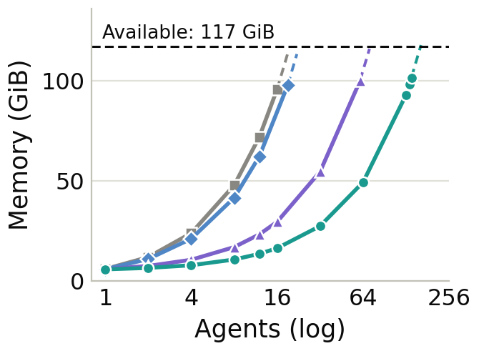 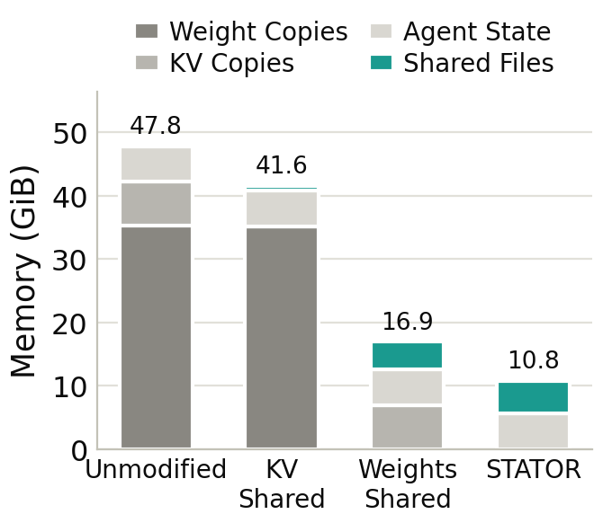 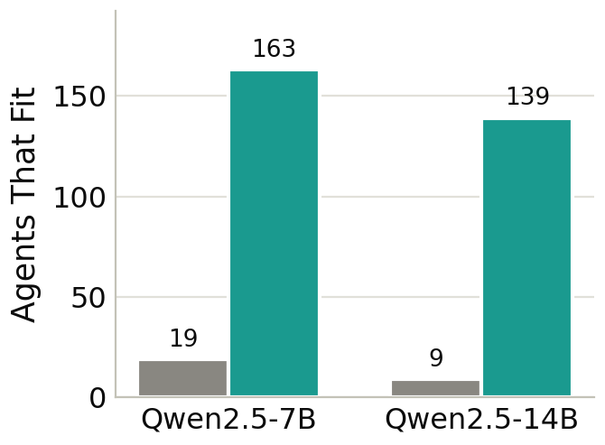 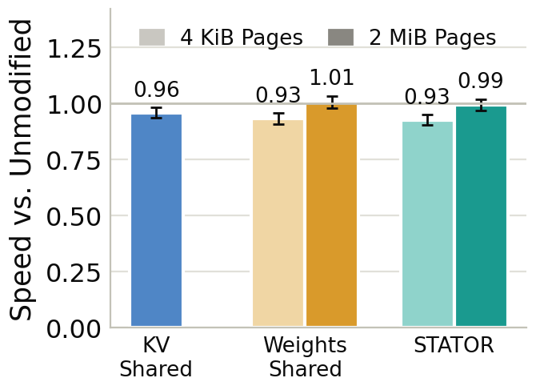</p>
<p align="center"><b>그림 21.</b> 전체 스택의 메모리(에이전트 수별, 에이전트 8개의 구성), 가용 메모리에 들어가는 에이전트 수, 무수정 대비 생성 속도. 회색: 무수정, 파랑: KV 공유, 보라: 가중치 공유, 청록: STATOR.</p>

**조정한 Device를 포함한 메커니즘 비교 (`20261007-engine-kvmech-v1`).** 4.10절의
다섯 방식 비교를 세 가지로 보강하여 다시 측정하였다. 첫째, Device 기준선을 두
단계로 조정하였다(`kv_tuned.patch`, `LLAMA_KV_VMM_BATCH`). 둘째, 자식 수(1, 4,
8)와 프리픽스 길이(4,081, 16,321토큰)를 바꾸었다. 셋째, 처리량 비를 반복별 짝으로
계산하고 중앙값을 함께 기록하였다. 아래는 부모 하나와 자식 8개, 16,321토큰
프리픽스, 모두 12-SM 인스턴스인 경우이다.

| 방식 | 부모 정지 (ms) | 자식 연결 (ms) | 첫 토큰 (s) | 자식 메모리 (GiB) | 처리량 (복사 대비) | 다른 인스턴스의 자식 |
|---|---:|---:|---:|---:|---:|---|
| Copy | 553 | 645 | 2.75 | 19.8 | 1.000 | 완료 |
| Demand | 549 | 793 | 2.94 | 13.9 | 1.009 | 완료 |
| Device (조정 전) | 39 | 811 | 2.91 | 7.6 | 1.015 | 가져오기 거부 |
| Device (접근 설정과 대기를 일괄 처리) | 37 | 473 | 2.55 | 7.6 | 1.005 | 가져오기 거부 |
| Device (텐서당 할당 1개로 병합) | 115 | 195 | 2.29 | 7.6 | 0.990 | 가져오기 거부 |
| CoW Map | 8.8 | 58 | 2.78 | 6.7 | 0.982 | 완료 |
| STATOR | 8.6 | 54 | 2.12 | 5.9 | 0.990 | 완료 |

Device의 연결 시간은 조정으로 811 ms에서 195 ms로 줄어든다. 조정 전 구현은 2 MiB
할당마다 접근을 설정하고 장치를 기다렸다. 이를 단계당 한 번으로 줄이면 473 ms가
되고, 남는 시간은 핸들 392개를 가져오는 시간이다. 자식 하나만 있으면 79 ms인데
자식 8개가 동시에 가져오면 드라이버가 이를 직렬화한다. 게시자가 게시할 행을
텐서당 할당 하나로 복사해 두면 핸들이 텐서당 하나로 줄어 195 ms가 되고, 그 복사
때문에 부모 정지가 37 ms에서 115 ms로 늘어난다. 할당은 늘리거나 합칠 수 없고
가장 작은 할당이 2 MiB이므로, 텐서당 하나가 최소이고 자식은 프리픽스가 끝나는
할당을 여전히 복사한다. 조정한 Device와 비교하면 STATOR의 연결은 3.6배 빠르고,
자식 하나일 때는 60 ms 대 44 ms이다. MIG 경계를 넘는 자식은 조정 여부와 관계없이
가져오기가 거부되어 반복마다 8개 중 4개만 완료한다.

CoW Map은 정지와 연결이 STATOR와 같다(자식 1개와 인스턴스를 넘는 배치에서는 1~5
ms 빠르다). 사전 기준 "익스텐트의 연결이 다른 모든 방식보다 빠르다"는 이 두
칸에서 충족되지 않는다. 차이는 메모리(6.7 대 5.9 GiB)와 첫 토큰(2.78 대 2.12 s)에
있다. 완료한 자식 1,146개는 모두 Copy와 같은 텍스트를 생성한다.

<p align="center">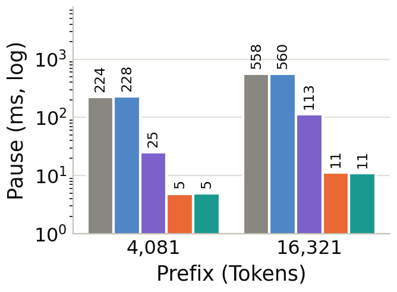 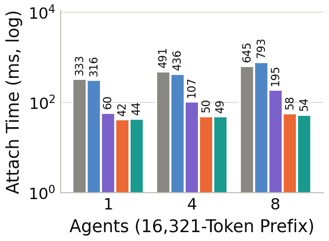 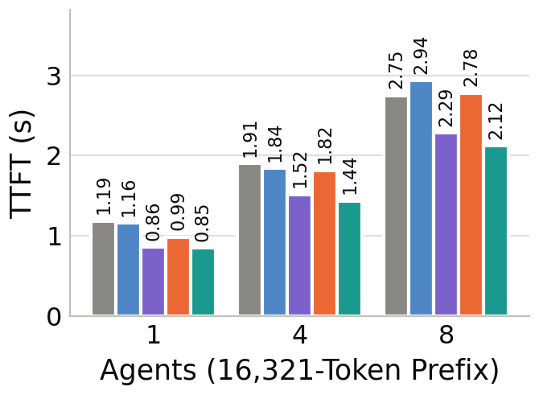</p>
<p align="center"><b>그림 22.</b> 다섯 방식의 부모 정지 시간, 자식 연결 시간, 첫 토큰. 회색: Copy, 파랑: Demand, 보라: Device(병합까지 조정), 주황: CoW Map, 청록: STATOR.</p>

<p align="center">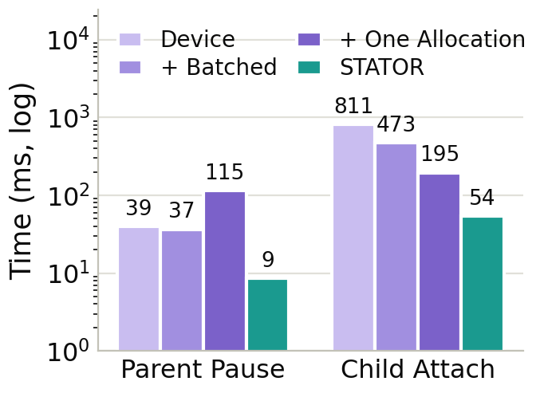</p>
<p align="center"><b>그림 23.</b> Device 기준선의 조정 단계별 부모 정지와 자식 연결 시간.</p>

<p align="center">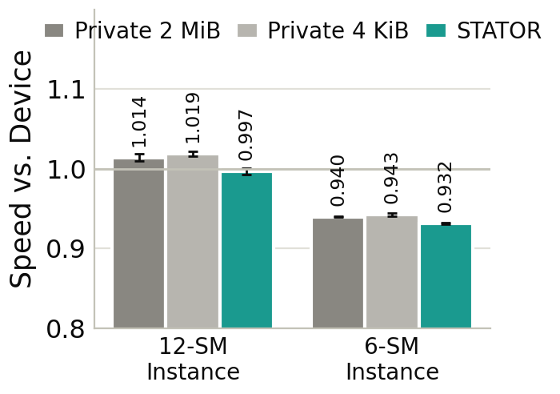 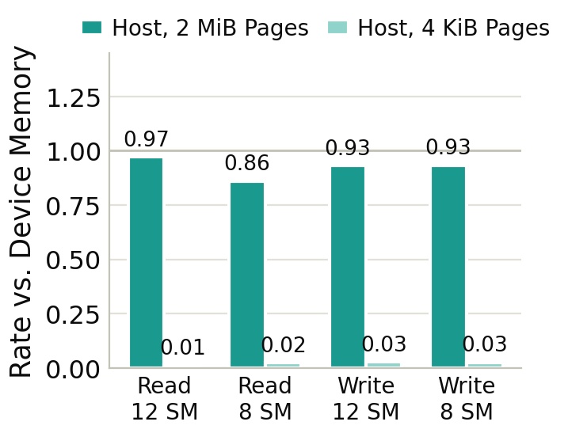</p>
<p align="center"><b>그림 24.</b> 디바이스 메모리 대비 호스트 메모리의 속도: 캐시의 형태별 생성 속도(인스턴스별), 1 GiB 버퍼에 대한 흩어진 접근.</p>

<p align="center">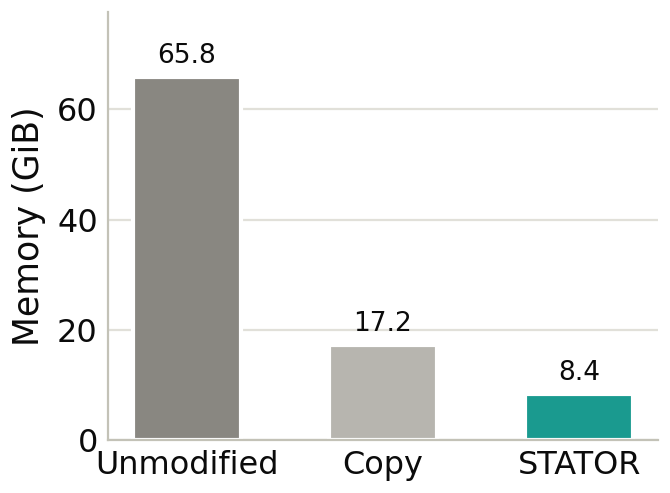 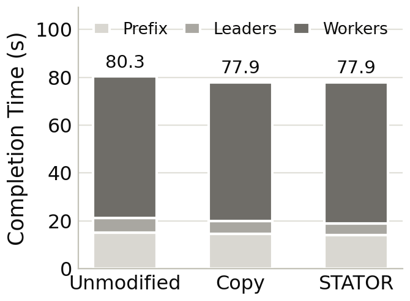 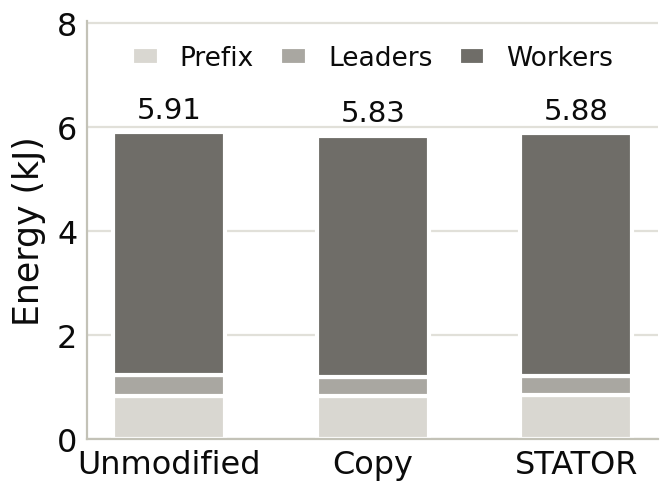</p>
<p align="center"><b>그림 25.</b> 에이전트 파이프라인의 메모리, 단계별 완료 시간, 단계별 입력 레일 에너지.</p>

### 4.12 vLLM 통합 (2026-10-07, 기록 6.15절)

앞 절까지의 서버는 이 연구가 수정한 엔진의 것이다. 이 절은 같은 설계를 배포용 배칭
서버인 vLLM 0.20.0에 플러그인으로 적용한다. vLLM은 한 서버 안의 요청 사이에서만
프리픽스를 공유하므로, 서버를 MIG 인스턴스마다 하나씩 두면 가중치와 프리픽스가
서버마다 한 벌씩 존재한다.

**플러그인 (`vllm_stator/`, 파이썬 460줄).** vLLM의 파일은 수정하지 않는다. 일반
플러그인 진입점(`vllm.general_plugins`)과 KV 커넥터 인터페이스만 사용하며, 환경
변수가 설정된 경우에만 다음 세 곳을 감싼다.

- **가중치.** 첫 서버는 vLLM이 모델을 적재하고 커널 형식으로 변환하도록 둔 뒤, 64 KiB
  이상인 텐서 283개(5.19 GiB)를 2 MiB 페이지 tmpfs의 파일 하나에 기록한다. 파일을
  매핑하고 GPU가 텐서를 매핑 위로 복사하므로 게시는 0.15 s에 끝난다(`tensor.cpu()`를
  거치면 21 s). 이후 모든 서버는 이 파일의 읽기 전용 공유 매핑 위에 CUDA 텐서를
  만들어 파라미터를 교체한다. 교체 뒤 디바이스 메모리에 남는 양은 5,343 MiB에서
  17 MiB로 줄고, vLLM은 "Model loading took 0.0 GiB memory"라고 기록한다.
- **프리픽스.** vLLM에 블록 하나가 모든 계층에 걸쳐 연속인 캐시 배치를 요청한다(이
  배치에서 16토큰 블록은 917,504바이트이다). 이 배치의 할당 하나를 바꾸어, 첫 서버의
  캐시는 파일의 공유 매핑이 되고, 나중에 시작하는 서버의 캐시는 사설 익명 메모리이되
  게시된 블록의 구간만 그 파일의 읽기 전용 공유 매핑이 된다. 첫 서버의 첫 요청이
  끝나면 커넥터가 가득 찬 블록의 해시를 기록하고 그 블록을 고정하며 구간을 쓰기
  금지한다. 나중 서버는 그 해시를 자기 블록 풀에 등록하므로, vLLM의 프리픽스 캐시가
  이 블록을 찾고 다른 요청에 내주지 않는다. 커넥터는 데이터를 옮기지 않는다.
- **장치 이름.** vLLM 0.20.0은 계층 모듈을 임포트하면서 `CUDA_VISIBLE_DEVICES`를 정수로
  해석하므로 MIG 식별자를 받지 못한다(4.11절). `python -m stator_vllm.serve`는 이름을
  먼저 받아들이게 한 뒤 vLLM의 명령행을 실행한다. 아래의 모든 구성은 기준선을 포함하여
  이 모듈로 시작한다.

두 서버는 같은 `PYTHONHASHSEED`를 사용해야 한다(vLLM이 블록 해시의 시드로 쓴다).
서버는 시작할 때 연결하므로, 프리픽스는 나중 서버가 캐시를 할당하기 전에 게시되어
있어야 한다.

**캠페인 (`run_vllm_share.sh`, `20261007-vllm-share-v1`).** Qwen2.5-7B-Instruct의 4비트
AWQ 가중치, 서버당 KV 캐시 2 GiB, `-O0`을 사용한다. 서버 1이 12-SM 인스턴스에서
시작하여 에이전트 워크로드의 프리픽스(14,282토큰)만 담은 요청에 응답한 뒤, 서버 2가
6-SM 인스턴스에서 시작한다. `first` 단계는 프리픽스를 계산한 적이 없는 서버 2에
에이전트 4개를 보내고, `both` 단계는 두 서버에 다른 에이전트를 4개씩 동시에 보내며,
`alone1`과 `alone2` 단계는 각 서버에 요청 하나를 단독으로 보낸다. 구성은 여섯 가지이고
6회 반복하며, 구성의 순서는 반복마다 돌아간다.

| 구성 | 내용 |
|---|---|
| vLLM | 수정하지 않은 서버 두 개 |
| vLLM-CPU | vLLM 자체의 캐시 블록 CPU 오프로드(`--kv-offloading-backend native`, 서버당 2 GiB). 버퍼는 서버 하나에 속한다 |
| vLLM-LMCache | LMCache 0.5.5. 두 서버가 함께 쓰는 호스트 메모리 저장소 프로세스(`lm://`), 256토큰 청크, 압축 없음, 서버 자체 캐시 없음, 서버당 스테이징 풀 1 GiB |
| 가중치만, 프리픽스만 | 플러그인의 두 부분 중 하나만 적용 |
| vLLM-STATOR | 플러그인의 두 부분 모두 적용 |

LMCache의 다중 프로세스 방식은 사용하지 않았다. 그 방식의 서버는 vLLM 작업자의
캐시를 CUDA IPC로 여는데, 두 MIG 인스턴스는 서로의 핸들을 받아들이지 않는다(2.3절).

| 구성 | 두 서버의 메모리 (GiB) | 시작 구간을 포함한 최대 (GiB) | 서버 2의 첫 토큰 (s) | 처리량 합 (tokens/s) | vLLM 대비 | 12-SM, 6-SM 서버 (vLLM 대비) |
|---|---:|---:|---:|---:|---:|---:|
| vLLM | 20.71 | 21.16 | 14.13 | 145.7 | 1.000 | 1.000, 1.000 |
| vLLM-CPU | 24.82 | 24.85 | 14.16 | 146.1 | 1.003 | 0.999, 1.007 |
| vLLM-LMCache | 26.01 | 26.06 | 1.79 | 145.1 | 0.996 | 0.995, 0.998 |
| 가중치만 | 15.22 | 21.01 | 14.19 | 137.9 | 0.946 | 1.007, 0.860 |
| 프리픽스만 | 20.00 | 21.22 | 0.63 | 142.4 | 0.977 | 0.997, 0.950 |
| vLLM-STATOR | 14.46 | 20.99 | 0.65 | 138.4 | 0.950 | 1.041, 0.820 |

메모리는 서버 1을 시작하기 전부터 사례가 끝날 때까지의 `MemAvailable` 감소이며 공유
파일을 포함한다.

**메모리.** 수정하지 않은 서버 두 개는 20.71 GiB를 차지한다. vLLM의 오프로드는 서버마다
버퍼를 더하고(24.82 GiB), LMCache는 스테이징 풀과 저장소 프로세스, 그리고 저장소 안의
세 번째 프리픽스 복사본을 더한다(26.01 GiB). 플러그인을 적용하면 14.46 GiB로
6.25 GiB가 줄어든다. 서버 2가 가중치 5.19 GiB와 프리픽스 블록 0.76 GiB를 복사하지 않고
매핑하기 때문이다. 다만 시작 구간의 최대값은 줄지 않는다(20.99 GiB 대 21.16 GiB).
vLLM의 로더를 그대로 사용하므로, 시작하는 서버는 플러그인이 교체할 때까지 가중치의
디바이스 복사본을 잠시 보유한다.

**서버 2의 첫 토큰.** vLLM, vLLM-CPU, `가중치만` 구성에서는 서버 2가 프리픽스를 직접
계산한다(14.1~14.2 s). LMCache에서는 저장소에서 14,080토큰을 0.90 s 동안 복사하고
1.79 s 뒤에 응답하며, 서버 1은 이 토큰을 저장하는 데 요청 안에서 0.41 s를 썼다.
플러그인에서는 서버 2가 시작할 때 블록 892개를 23 ms에 매핑하고 0.65 s 뒤에
응답하며, 게시는 아무것도 복사하지 않는다.

**처리량.** `both` 단계의 에이전트 8개의 생성 속도 합은 플러그인에서 138.4 tokens/s,
vLLM에서 145.7 tokens/s이고, 반복별로 짝지은 비는 0.950(중앙값 0.951)이다. 손실은
6-SM 인스턴스에 있다. 6-SM 서버는 vLLM의 0.820으로 생성하고 12-SM 서버는 1.041로
생성한다. 가중치만 공유하면 6-SM 서버는 0.860, 프리픽스만 공유하면 0.950이다. 4.5절이
이 엔진에서 측정한 6-SM 인스턴스의 호스트 메모리 비용과 같은 방향이며, 여기서는
가중치도 호스트 메모리에서 읽으므로 더 크다. 인스턴스별로 공유할 상태를 고를 수 있다.

**텍스트.** 요청을 단독으로 보낸 `alone1`, `alone2`에서는 모든 구성이 두 인스턴스에서
6회 모두 vLLM과 같은 텍스트를 생성한다. `alone2`에서 플러그인과 LMCache의 프리픽스는
다른 인스턴스가 계산한 것이다. 동시 요청에서는 vLLM 자신을 제외한 모든 구성에서 몇
개가 달라지며, 아무것도 공유하지 않는 구성도 같다(72개 중 vLLM-CPU 67개, LMCache
69개, 플러그인 세 구성 66~67개가 같음). vLLM이 한 서버의 시퀀스를 배치로 묶고 그
구성이 실행마다 달라지기 때문이다. 사전 기준 V1~V6은 모두 충족된다.

**서버 네 개 (`SERVERS=4`, `20261007-vllm-share-4srv-v2`, 2회 반복).** 서버 3과 4가 두
인스턴스에 하나씩 더 시작하여 서버 2와 같은 방식으로 연결한다. `both` 단계 전에 서버
3과 4에 요청을 하나씩 보내 모든 서버가 프리픽스를 가진 상태에서 에이전트 16개가
동시에 생성하게 한다(`run_vllm_share2.sh`).

| 구성 | 네 서버의 메모리 (GiB) | 시작 구간을 포함한 최대 (GiB) | 서버 2의 첫 토큰 (s) | 처리량 합 (tokens/s) | vLLM 대비 | 12-SM, 6-SM 서버 (vLLM 대비) |
|---|---:|---:|---:|---:|---:|---:|
| vLLM | 41.68 | 41.73 | 14.08 | 131.5 | 1.000 | 1.000, 1.000 |
| vLLM-LMCache | 50.35 | 50.37 | 1.86 | 131.0 | 0.996 | 0.994, 0.999 |
| vLLM-STATOR | 22.74 | 29.28 | 0.66 | 121.8 | 0.926 | 1.000, 0.823 |

서버가 둘에서 넷으로 늘 때 서버 하나당 메모리는 vLLM에서 10.5 GiB, 플러그인에서
4.1 GiB 늘어난다(캐시 예약 2 GiB에서 프리픽스를 뺀 양과 프로세스 자체). 시작하는
서버의 디바이스 복사본은 한 번에 하나만 존재하므로 최대값도 29.28 GiB로 vLLM의
41.73 GiB보다 낮다. 처리량의 손실은 서버가 둘일 때와 같이 6-SM 인스턴스에 있다. 사전
기준은 모두 충족된다.

먼저 수행한 `20261007-vllm-share-4srv-v1`은 서버 3과 4를 미리 데우지 않았다. vLLM과
LMCache에서 이 두 서버가 `both` 단계 안에서 프리픽스를 계산하거나 가져왔고, 그
에이전트들은 서버 1과 2의 에이전트가 끝난 뒤에 생성하였다. 그 캠페인의 처리량 합은
서로 다른 시간대의 속도를 더한 값이므로 구성 사이의 비교가 아니며, 사전 기준 V5는 그
캠페인에서 충족되지 않는다(0.519). 메모리와 첫 토큰은 두 캠페인이 일치한다.

<p align="center">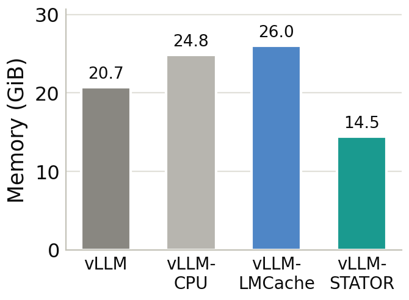 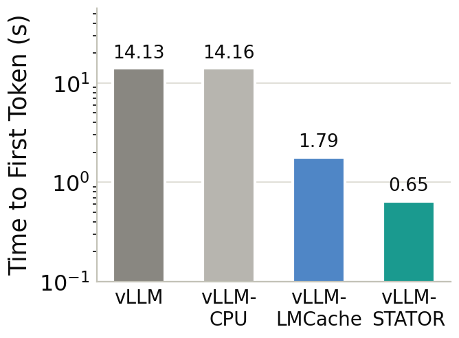 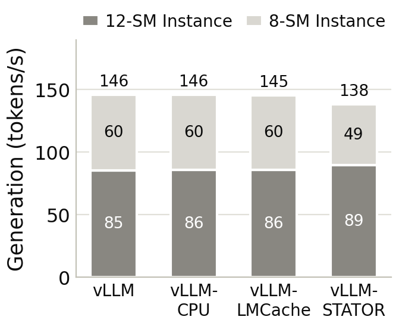</p>
<p align="center"><b>그림 26.</b> MIG 인스턴스마다 하나씩 둔 vLLM 서버 두 개: 두 서버의 메모리, 프리픽스를 계산한 적이 없는 두 번째 서버의 첫 토큰(로그 축), 인스턴스별 생성 속도.</p>

## 5. 한계

- 주 평가는 장치 한 대, 엔진 하나, 7B 모델 하나에서 수행하였고, 8B와 14B
  모델은 에이전트 8개인 경우만 반복하였다. DGX Spark, Grace Hopper, Apple
  장치에서는 측정하지 않았다.
- 캐시 실험 대부분은 작은 드라이버 프로그램(`kv_fork`, `kv_batch`,
  `kv_spawn`, `kv_tree`)으로 수행하였다. `llama-server` 경로는 슬롯 저장과
  복원으로 검증하였으며, 프리픽스를 토큰 경계에서 게시해야 복사와 같은 응답이
  나온다.
- 익스텐트 체인은 네 단계(프로세스 23개)와 잎 16개의 트리까지 측정하였다.
- 에이전트는 게시자를 신뢰한다. 캐시 파일을 쓸 수 있는 주체는 모든 에이전트의
  프리픽스를 바꿀 수 있다. 캐시를 공유하는 프로세스 사이의 타이밍 채널은 다루지
  않는다. MIG 인스턴스 사이의 공유는 한 테넌트의 에이전트를 대상으로 한다.
- 6-SM 인스턴스에서 호스트 메모리의 비용(KV 캐시 6.0~6.8%, 가중치까지 호스트
  메모리에서 읽는 vLLM 서버 18%)은 공유나 페이지 크기와 무관하다는 것까지 분리하였다.
  탐침에서는 호스트 메모리의 흩어진 읽기만 이 인스턴스에서 더 느렸고, 그 아래의
  원인은 조사하지 않았다.
- 캐시는 flash attention과 단일 스트림을 사용해야 한다. 동결된 셀은 해당
  에이전트가 다시 쓰지 못한다. 캐시 파일은 스왑이 없는 장치에서 회수되지 않는
  메모리이다.
- vLLM 플러그인은 서버가 시작할 때 프리픽스에 연결한다. 실행 중인 서버에 나중에
  게시된 프리픽스를 붙이는 경로는 구현하지 않았다. vLLM의 로더를 그대로 쓰므로
  시작하는 서버는 가중치의 디바이스 복사본을 교체 전까지 보유하고, 시작 구간의 최대
  메모리는 줄지 않는다. 6-SM 인스턴스의 서버는 가중치와 캐시를 호스트 메모리에서
  읽을 때 생성 속도의 18%를 잃는다. 동시 요청의 텍스트는 vLLM의 배치 구성에 따라
  달라지므로 단독 요청으로만 동일성을 확인하였다.
- Demand, Device 기준선은 선행 연구의 방식을 이 연구에서 같은 엔진에 구현한
  것이며 해당 연구의 코드가 아니다. Device의 연결 시간은 조정하지 않은 구현의
  값이다.

## 6. 구성물과 재현

평가 그래프는 한 가지 색 규칙을 쓴다. 회색은 상태를 복사하는 기준선(Copy, 무수정, vLLM), 청록은 STATOR이고, 그 밖의 방식은 파랑, 보라, 주황 순서로 칠한다. 같은 색의 연한 색조는 그 대상의 변형이다(`figures/make_paper_figures.py`의 첫 부분).

### 6.1 파일 구성

| 파일 | 역할 |
|---|---|
| `llama.cpp/` + `inplace_weights.patch` | llama.cpp 커밋 `6f767fe96`의 클론과 가중치 변경 |
| `llama.cpp-kv/` + `kv_extents.patch` | 같은 커밋의 두 번째 클론과 가중치 및 캐시 변경 |
| `llama.cpp-vmm/` + `kv_vmm.patch` | 디바이스 메모리 방식을 더한 세 번째 클론. 캠페인 하나에서만 사용 |
| `llama.cpp-chain/` + `kv_chain.patch` | 에이전트가 추가한 행을 다시 게시하는 다단계 체인 |
| `llama.cpp-sota/` + `kv_sota.patch` | 프리픽스를 넘기는 다섯 방식을 한 엔진에서 비교하는 클론 |
| `llama.cpp-tuned/` + `kv_tuned.patch` | 위 클론에 Device 기준선의 조정(`LLAMA_KV_VMM_BATCH`)과 단계 제거 스위치(`LLAMA_KV_TOUCH=0`, `LLAMA_KV_POPULATE=0`)를 더한 클론 |
| `llama.cpp-stock/` | 패치를 적용하지 않은 같은 커밋의 클론. 무수정 스택의 기준 |
| `kv_fork.cpp` | 프리픽스 공유 실험의 한 역할: 단독 계산, 부모로서 게시, 자식으로서 연결 |
| `kv_batch.cpp` | 여러 시퀀스를 처리하는 배칭 서버의 같은 역할 |
| `kv_spawn.cpp` | 게시한 뒤 자식을 직접 실행하는 부모. 자식이 공유 디바이스 메모리의 핸들을 상속한다 |
| `kv_tree.cpp` | 에이전트 트리와 파이프라인의 한 프로세스. 텍스트 디코딩, 상태 적재·저장, 대기, 생성 단계를 인자로 받는다 |
| `kv_fork_nommap.cpp` | 모델 파일을 매핑하지 않고 읽는 `kv_fork`. 프리픽스만 공유하는 스택에 사용 |
| `weights_publish.c` | 모델 파일을 저장 장치에서 직접 읽어 2 MiB 페이지의 공유 매핑에 채우는 도구 |
| `cuda_tlb_probe.cu` | 메모리 종류별로 연속 읽기, 흩어진 읽기, 흩어진 쓰기의 속도를 측정 |
| `make_workload.py`, `make_workload_bfcl.py`, `workloads/` | 에이전트 워크로드와, 공개 함수 호출 벤치마크(BFCL v4, Apache-2.0)의 도구 스키마와 요청으로 만든 워크로드 |
| `openai_client.py`, `throughput_ratios.py` | OpenAI 호환 서버의 요청 드라이버, 원시 로그에서 반복별 처리량 비와 중앙값을 계산하는 도구 |
| `vllm_stator/` | vLLM 0.20.0용 플러그인 `stator_vllm`. vLLM 소스를 수정하지 않고 가중치와 프리픽스의 캐시 블록을 서버 사이의 호스트 매핑으로 공유한다(`__init__.py`: 가중치 게시와 연결, 캐시 메모리 배치. `connector.py`: 게시한 블록을 캐시에 등록하는 커넥터. `serve.py`: MIG 식별자를 받는 시작 모듈) |
| `vllm_share_client.py` | 여러 vLLM 서버에 같은 프리픽스의 요청을 나누어 보내는 드라이버 |
| `cuda_ipc_probe.cu`, `cuda_vmm_probe.cu` | 주어진 배치에서 GPU 수준 경로가 두 프로세스 사이의 메모리를 공유하는지 확인 |
| `cuda_share_load_probe.cu` | 세 번째 프로세스가 GPU를 사용하는 동안 공유 메모리를 읽을 수 있는지 확인(진단용, 캠페인 없음) |
| `cuda_vmm_attach_probe.cu`, `cuda_protect_probe.cu` | VMM 연결 비용과 두 공유 경로의 쓰기 보호를 측정 |
| `ollama_client.py`, `ollama_mig_visible.c` | Ollama 요청 드라이버와, MIG 인스턴스 식별자를 러너에 전달하는 호환 라이브러리 |
| `kv_file_diff.py` | 두 캐시 파일을 값 단위로 비교 |
| `make_lora.py` | GGUF 모델용 합성 LoRA 어댑터 생성 |
| `models/` | 캠페인에 사용한 모델(내려받은 것이며 저장소에 포함되지 않는다) |
| `summarize_*.awk`, `tables.py` | 분석과 기록의 표 |
| `figures/` | 이 문서의 그림. TikZ 소스는 `figures/src/`, 그래프는 `make_eval_figures.py`(`results/`에서 읽음), `build.sh`가 PDF와 PNG를 만든다 |
| `docs/` | 연구 기록, 기반 측정 기록, 선행 연구 조사. `docs/record_src/`에 기록의 절과 표, 이를 조립하는 `assemble.py`가 있다 |
| `results/` | 모든 캠페인의 원시 로그, 요약, 메타데이터, 고정된 소스 해시 |
| `verify_llm_share_artifact.sh`, `verify_stator_campaigns.sh` | GPU 없이 모든 결과를 원시 로그에서 다시 계산하고 고정된 소스 해시와 사전 기준을 확인 |

| 러너 | 측정 내용 | 절 |
|---|---|---|
| `run_engine_single.sh`, `run_engine_pages.sh` | 프로세스 1개에서 디바이스 복사와 in-place 비교, 매핑한 모델의 페이지 크기 | 4.1 |
| `run_engine_adapters.sh` | 프로세스 5개, 어댑터 4개, 기반 모델 1개 | 4.1 |
| `run_engine_agents.sh` | MIG, 시분할, MPS에서 프로세스 N개 | 4.1, 4.8 |
| `run_engine_batched.sh`, `run_engine_groups.sh` | 시퀀스 N개를 처리하는 프로세스 1개, MIG 인스턴스마다 배칭 서버 1개 | 4.8 |
| `run_sharing_routes.sh`, `run_vmm_routes.sh` | 세 가지 배치에서 CUDA IPC, CUDA 가상 메모리 인터페이스, 호스트 페이지 테이블 | 2.3, 4.7 |
| `run_engine_prefix.sh` | 엔진의 기존 도구를 사용한 프리픽스 공유 | 4.2 |
| `run_engine_kvshare.sh` | 게시된 프리픽스 위의 에이전트 N개: 재계산, 복사, copy-on-write, 익스텐트 | 4.2 |
| `run_engine_kvfork.sh` | 자식에게 상태를 넘기고 계속 생성하는 부모 | 4.4 |
| `run_engine_kvdet.sh` | 반복과 MIG 인스턴스에 따른 프리픽스 캐시의 비트 | 4.8 |
| `run_engine_kvcow.sh` | CPU 읽기 유무에 따른 copy-on-write | 4.3 |
| `run_engine_kvspeed.sh` | 캐시를 디바이스 메모리와 호스트 메모리에 둔 경우의 생성 속도 | 4.5 |
| `run_engine_kvbatch.sh` | 배칭 서버 1개와 MIG 인스턴스마다 1개에서의 에이전트 8개 | 4.6 |
| `run_engine_kvvmm.sh` | 익스텐트, 디바이스 메모리 방식, 복사의 비교 | 4.7 |
| `run_engine_kvmps.sh`, `run_engine_kvsota.sh` | GPU 공유 방식 네 가지와 한 엔진 안의 다섯 방식 | 4.10 |
| `run_engine_kvtree.sh`, `run_engine_kvscale.sh` | 에이전트 트리, 에이전트 32개까지의 규모, 모델과 워크로드 변형 | 4.10 |
| `run_engine_kvserver.sh`, `run_engine_kvserver2.sh`, `run_engine_kvlimit.sh` | 기존 서버의 슬롯 저장·복원(두 번째는 토큰 경계에서 게시), cgroup 메모리 한도 | 4.10 |
| `run_read_path.sh`, `run_vmm_attach.sh`, `run_protect.sh` | 읽기 경로, 디바이스 메모리 연결 비용, 쓰기 보호 탐침 | 4.10 |
| `run_ollama_agents.sh` | 별도 인스턴스로 실행한 Ollama 기준선(첫 요청과 재요청) | 4.10 |
| `run_engine_kvstack.sh` | 무수정 엔진을 포함한 전체 스택의 메모리와 수용 한계 | 4.11 |
| `run_engine_kvmech.sh` | 조정한 Device를 포함한 메커니즘 비교(프리픽스 길이와 에이전트 수 변화), 단계 제거, 6-SM 손실의 원인 분리 | 4.11 |
| `run_tlb_probe.sh` | 흩어진 접근의 메모리 종류별 속도 | 4.11 |
| `run_engine_kvpipe.sh` | 공개 벤치마크 도구 위의 계획자·리더·작업자 파이프라인, 단계별 에너지 | 4.11 |
| `run_engine_kvfault.sh` | GPU 공유 방식별 결함 주입과 생존한 에이전트 수 | 4.11 |
| `run_engine_kvdeep.sh` | 깊거나 넓은 트리, 서브트리 종료 시 메모리 반환 | 4.11 |
| `run_ext_weightshare.sh` | CUDA IPC로 가중치를 공유하는 공개 라이브러리 기준선 | 4.11 |
| `run_weights_publish.sh` | 모델 파일을 2 MiB 페이지에 올리는 세 방법의 시간과 메모리 | 4.11 |
| `run_ext_vllm.sh` | 프로세스 하나 안에서 프리픽스를 공유하는 vLLM 기준선 | 4.11 |
| `run_vllm_share.sh` | MIG 인스턴스마다 vLLM 서버 하나: 무수정, CPU 오프로드, LMCache, 플러그인(가중치만, 프리픽스만, 둘 다) | 4.12 |

### 6.2 빌드

```bash
git clone <llama.cpp> llama.cpp && git -C llama.cpp checkout 6f767fe96
git -C llama.cpp apply ../inplace_weights.patch
cmake -S llama.cpp -B llama.cpp/build -DGGML_CUDA=ON -DCMAKE_BUILD_TYPE=Release \
  -DCMAKE_CUDA_ARCHITECTURES=110 -DLLAMA_CURL=OFF
cmake --build llama.cpp/build -j 12 --target llama-bench llama-completion \
  llama-batched-bench
python3 make_lora.py models/MODEL.gguf adapters/lora_1.gguf 1

# 캐시 변경을 적용한 엔진과 이를 링크하는 드라이버
git clone <llama.cpp> llama.cpp-kv && git -C llama.cpp-kv checkout 6f767fe96
git -C llama.cpp-kv apply ../kv_extents.patch
cmake -S llama.cpp-kv -B llama.cpp-kv/build -DGGML_CUDA=ON -DCMAKE_BUILD_TYPE=Release \
  -DCMAKE_CUDA_ARCHITECTURES=110 -DLLAMA_CURL=OFF
cmake --build llama.cpp-kv/build -j 12 --target llama-completion llama-bench
make                      # 프로브, kv_fork, kv_batch

# 디바이스 메모리 캐시를 더한 엔진과 그 드라이버 두 개
git clone <llama.cpp> llama.cpp-vmm && git -C llama.cpp-vmm checkout 6f767fe96
git -C llama.cpp-vmm apply ../kv_vmm.patch
cmake -S llama.cpp-vmm -B llama.cpp-vmm/build -DGGML_CUDA=ON -DCMAKE_BUILD_TYPE=Release \
  -DCMAKE_CUDA_ARCHITECTURES=110 -DLLAMA_CURL=OFF
cmake --build llama.cpp-vmm/build -j 12 --target llama
make kv_spawn kv_fork_vmm

# 다단계 체인과 다섯 경로 비교용 클론
git clone <llama.cpp> llama.cpp-chain && git -C llama.cpp-chain checkout 6f767fe96
git -C llama.cpp-chain apply ../kv_chain.patch
cmake -S llama.cpp-chain -B llama.cpp-chain/build -DGGML_CUDA=ON \
  -DCMAKE_BUILD_TYPE=Release -DCMAKE_CUDA_ARCHITECTURES=110 -DLLAMA_CURL=OFF
cmake --build llama.cpp-chain/build -j 12 --target llama
make kv_tree

git clone <llama.cpp> llama.cpp-sota && git -C llama.cpp-sota checkout 6f767fe96
git -C llama.cpp-sota apply ../kv_sota.patch
cmake -S llama.cpp-sota -B llama.cpp-sota/build -DGGML_CUDA=ON \
  -DCMAKE_BUILD_TYPE=Release -DCMAKE_CUDA_ARCHITECTURES=110 -DLLAMA_CURL=OFF
cmake --build llama.cpp-sota/build -j 12 --target llama
make kv_fork_sota kv_spawn_sota ollama_mig_visible.so

# 조정한 Device와 단계 제거 스위치를 더한 클론, 패치하지 않은 클론
git clone <llama.cpp> llama.cpp-tuned && git -C llama.cpp-tuned checkout 6f767fe96
git -C llama.cpp-tuned apply ../kv_tuned.patch
cmake -S llama.cpp-tuned -B llama.cpp-tuned/build -DGGML_CUDA=ON \
  -DCMAKE_BUILD_TYPE=Release -DCMAKE_CUDA_ARCHITECTURES=110 -DLLAMA_CURL=OFF
cmake --build llama.cpp-tuned/build -j 12 --target llama
git clone <llama.cpp> llama.cpp-stock && git -C llama.cpp-stock checkout 6f767fe96
cmake -S llama.cpp-stock -B llama.cpp-stock/build -DGGML_CUDA=ON \
  -DCMAKE_BUILD_TYPE=Release -DCMAKE_CUDA_ARCHITECTURES=110 -DLLAMA_CURL=OFF
cmake --build llama.cpp-stock/build -j 12 --target llama
make kv_fork_tuned kv_spawn_tuned kv_fork_stock kv_tree_stock kv_fork_nommap cuda_tlb_probe \
  weights_publish
```

vLLM 캠페인(4.12절)은 엔진 빌드와 별개이다. vLLM 0.20.0과 그 의존 모듈을 설치한 가상
환경(`ext/venv-vllm`, 저장소에 포함되지 않는다)에 플러그인을 설치하고, LMCache는 그
환경을 바꾸지 않도록 별도 디렉터리에 풀어 `lmcache` 모드에서만 경로에 넣는다.

```bash
ext/venv-vllm/bin/pip install --no-deps --no-build-isolation -e vllm_stator
ext/venv-vllm/bin/pip download --no-deps lmcache==0.5.5 -d ext/lmcache-dl
python3 -m zipfile -e ext/lmcache-dl/lmcache-0.5.5-*.whl ext/lmcache-site/
ext/venv-vllm/bin/pip install --no-deps --target ext/lmcache-site sortedcontainers aiofile caio
```

`kv_extents.patch`는 `inplace_weights.patch`를 포함하고, `kv_vmm.patch`는
`kv_extents.patch`를 포함하며, `kv_tuned.patch`는 `kv_sota.patch`를 포함한다. 각 클론에는 해당 패치만 적용되어 있다. 클론,
모델, 어댑터, 빌드된 프로그램은 저장소에 포함되지 않는다.

### 6.3 캠페인

vLLM 캠페인의 서버 로그(`results/*vllm*/server*.log`)에서는 vLLM이 기록한 호스트의 네트워크
주소를 `HOST-ADDRESS`로 바꾸었다. 요약은 `raw.log`에서 계산하므로 검증에는 영향이 없다.

GPU 캠페인은 동시에 실행하지 않는다. MPS 서버를 시작하는 캠페인은 제어 소켓을
둘 짧은 디렉터리가 필요하고(`MPS_ROOT`, 약 85자 이하), 다른 MPS 데몬이 실행
중이면 실행을 거부한다. `run_engine_pages.sh`는 `sudo`로 tmpfs와 hugetlbfs를
마운트하고 hugetlb 풀을 예약한다. `run_engine_kvdet.sh`를 제외한
`run_engine_kv*.sh` 러너는 캐시 파일용 tmpfs를 마운트한다. 모든 러너는 종료할
때 자신이 만든 것을 제거한다. 실행 중인 러너 스크립트는 편집하지 않는다. 셸이
스크립트를 실행하면서 읽기 때문이다.

```bash
RESULT_TAG=engine-single-rerun   ./run_engine_single.sh
RESULT_TAG=engine-pages-rerun    ./run_engine_pages.sh
RESULT_TAG=engine-adapters-rerun ./run_engine_adapters.sh
RESULT_TAG=engine-batched-rerun  ./run_engine_batched.sh
RESULT_TAG=engine-groups-rerun   ./run_engine_groups.sh
RESULT_TAG=engine-prefix-rerun   ./run_engine_prefix.sh
MPS_ROOT=/tmp/hm RESULT_TAG=engine-agents-rerun  ./run_engine_agents.sh
MPS_ROOT=/tmp/hm RESULT_TAG=sharing-routes-rerun ./run_sharing_routes.sh
MPS_ROOT=/tmp/hm RESULT_TAG=vmm-routes-rerun     ./run_vmm_routes.sh
RESULT_TAG=engine-kvshare-rerun  ./run_engine_kvshare.sh
awk -v table=publish -f summarize_engine_kvshare.awk \
  results/engine-kvshare-rerun/raw.log \
  >results/engine-kvshare-rerun/engine_kvshare_publish.csv
RESULT_TAG=engine-kvfork-rerun   ./run_engine_kvfork.sh
RESULT_TAG=engine-kvdet-rerun    ./run_engine_kvdet.sh
RESULT_TAG=engine-kvcow-rerun    ./run_engine_kvcow.sh
RESULT_TAG=engine-kvspeed-rerun  ./run_engine_kvspeed.sh
RESULT_TAG=engine-kvbatch-rerun  ./run_engine_kvbatch.sh
RESULT_TAG=engine-kvvmm-rerun    ./run_engine_kvvmm.sh
RESULT_TAG=engine-kvmps-rerun    ./run_engine_kvmps.sh
RESULT_TAG=engine-kvsota-rerun   ./run_engine_kvsota.sh
RESULT_TAG=engine-kvtree-rerun   ./run_engine_kvtree.sh
RESULT_TAG=engine-kvscale-rerun  ./run_engine_kvscale.sh
RESULT_TAG=engine-kvserver-rerun ./run_engine_kvserver.sh
RESULT_TAG=engine-kvlimit-rerun  ./run_engine_kvlimit.sh
RESULT_TAG=read-path-rerun       ./run_read_path.sh
RESULT_TAG=vmm-attach-rerun      ./run_vmm_attach.sh
RESULT_TAG=protect-rerun         ./run_protect.sh
RESULT_TAG=ollama-agents-rerun   ./run_ollama_agents.sh
RESULT_TAG=engine-kvstack-rerun  ./run_engine_kvstack.sh
RESULT_TAG=engine-kvmech-rerun   ./run_engine_kvmech.sh
MODE_SET=ablation RESULT_TAG=engine-kvablate-rerun ./run_engine_kvmech.sh
MODE_SET=locality N_GEN=128 RESULT_TAG=engine-kvlocal-rerun ./run_engine_kvmech.sh
RESULT_TAG=tlb-probe-rerun       ./run_tlb_probe.sh
RESULT_TAG=engine-kvpipe-rerun   ./run_engine_kvpipe.sh
MPS_ROOT=/tmp/kf RESULT_TAG=engine-kvfault-rerun ./run_engine_kvfault.sh
RESULT_TAG=engine-kvdeep-rerun   ./run_engine_kvdeep.sh
RESULT_TAG=ext-weightshare-rerun ./run_ext_weightshare.sh
RESULT_TAG=weights-publish-rerun ./run_weights_publish.sh
RESULT_TAG=ext-vllm-rerun        ./run_ext_vllm.sh
RESULT_TAG=vllm-share-rerun      ./run_vllm_share.sh
SERVERS=4 REPETITIONS=2 MODES="vllm lmcache stator" RESULT_TAG=vllm-share-4srv-rerun ./run_vllm_share.sh
./verify_llm_share_artifact.sh
./verify_stator_campaigns.sh results
```

`verify_llm_share_artifact.sh`는 GPU가 필요하지 않으며 새로 받은 저장소에서
실행된다. 엔진 클론이 있으면 각 패치를 클론과 대조하고, 기반 측정 프로젝트가
이 저장소 옆에 있으면 그 프로젝트의 고정된 소스를 확인한다. 건너뛴 소스의 수는
출력에 표시된다. 러너 두 개(`run_sharing_routes.sh`와, 기록 5절의 표 두 개를
만드는 `tables.py`)는 기반 측정 프로젝트를 사용하며 `../thor_hostmm`에 있어야
한다.

캠페인 이후 기록과 그림을 다시 만드는 방법은 다음과 같다.

```bash
python3 tables.py results ../thor_hostmm/results docs/record_src
python3 docs/record_src/assemble.py
figures/build.sh          # pdflatex, pdftoppm, matplotlib 필요
```

## 7. 사용법

### 7.1 가중치 in-place

```bash
GGML_CUDA_HOST_PTR=1 llama.cpp/build/bin/llama-completion -m MODEL.gguf -ngl 99 ...
```

- 같은 파일을 매핑한 모든 프로세스가 그 페이지를 공유한다. 서빙 프로세스가
  파일을 쓸 수 없게 유지한다. 파일을 쓸 수 있는 주체는 모든 프로세스의 모델을
  바꿀 수 있다.
- 4 KiB 페이지의 비용을 없애려면 모델을 `huge=always`로 마운트한 tmpfs나
  hugetlbfs에 둔다.
- `GGML_CUDA_HOST_PTR_PREREAD=0`은 CPU가 모든 페이지를 읽는 과정을 생략한다.
- MPS에서는 클라이언트 하나의 GPU 폴트가 같은 서버의 모든 클라이언트를
  종료시킨다. 서로의 장애에서 살아남아야 하는 프로세스는 다른 MIG 인스턴스에
  두거나 MPS 없이 실행한다.

### 7.2 캐시 익스텐트

캐시 변경은 `llama.cpp-kv`를 사용하는 프로세스의 환경 변수로 선택한다.
`LLAMA_KV_HOST`가 없으면 엔진은 원본과 같이 동작한다.

```bash
# 게시자: 프리픽스를 계산한다. 캐시는 파일 /mnt/kv/prefix.0 이다
GGML_CUDA_HOST_PTR=1 LLAMA_KV_HOST=/mnt/kv/prefix LLAMA_KV_GROW=256 \
  ./kv_fork parent MODEL.gguf 8192 prefix.txt prefix.state "" 0
# 에이전트: 앞의 4081행을 읽기 전용으로 매핑하고 그 뒤에 자신의 행을 쓴다
GGML_CUDA_HOST_PTR=1 LLAMA_KV_HOST=/mnt/kv/prefix LLAMA_KV_PREFIX=4081 \
  LLAMA_KV_GROW=256 ./kv_fork child MODEL.gguf 8192 prefix.state "QUESTION" 64
```

| 환경 변수 | 의미 |
|---|---|
| `LLAMA_KV_HOST=anon` | 캐시를 사설 호스트 메모리에 둔다 |
| `LLAMA_KV_HOST=PATH` | 게시자. 캐시는 파일 `PATH.0`이다. 컨텍스트의 상태를 저장하면 사용 중인 행이 게시된다 |
| `LLAMA_KV_PREFIX=ROWS` | 위 변수와 함께 쓰면 에이전트. 앞의 `ROWS`행은 파일의 읽기 전용 매핑이다 |
| `LLAMA_KV_GROW=ROWS` | 메모리가 사용 중인 행을 `ROWS`행 단위로 따라간다 |
| `LLAMA_KV_COW=1` 또는 `2` | 측정 결과가 반대하는 대안. 에이전트가 파일 전체를 쓰기 가능한 사설 매핑으로 매핑한다. `2`는 CPU 읽기를 생략한다 |
| `LLAMA_KV_VMM=1`, `LLAMA_KV_VMM_IMPORT` | `llama.cpp-vmm` 전용. 디바이스 메모리 방식 |

- 게시자의 상태를 저장하면(`llama_state_save_file` 또는 `llama-completion`의
  `--prompt-cache`) 게시된다. 에이전트는 그 상태 파일만 읽을 수 있고, 자신의
  상태를 저장하지 못한다.
- 캐시 파일은 `huge=always`로 마운트한 tmpfs에 두고, 에이전트가 쓸 수 없게
  유지한다.
- 긴 프리픽스를 공유하는 에이전트는 12-SM 인스턴스에 둔다(4.5절).
- 에이전트는 GPU를 사용한 프로세스의 `fork`가 아니라 `posix_spawn`이나 `exec`로
  시작한다.
- 한 프로세스에 둘 수 있는 에이전트는 한 프로세스에 둔다(4.6절).
