# llm_share: model state as extents for on-device LLM serving

Serving processes of one LLM on a Jetson AGX Thor share a single physical
copy of the model weights and of the key-value cache of a prompt prefix they
have in common. The GPU reads both in place through the host page tables.

Full record: [docs/RESEARCH_LLM_SHARE_2026-10-05.md](docs/RESEARCH_LLM_SHARE_2026-10-05.md)
(Section 6 for the cache).
Substrate measurements: [docs/RESEARCH_HOSTMM_2026-10-05.md](docs/RESEARCH_HOSTMM_2026-10-05.md);
their code and raw results are the `thor_hostmm` project, which is not part of
this repository.
Prior-art audits: [docs/SOTA_HOSTMM_2026-10-05.md](docs/SOTA_HOSTMM_2026-10-05.md),
Sections 12, 14, 16, 17.

Contents: [1 Introduction](#1-introduction) |
[2 Background](#2-background) | [3 Design](#3-design) |
[4 Evaluation](#4-evaluation) | [5 Limits](#5-limits) |
[6 Artifact](#6-artifact) | [7 Using the paths](#7-using-the-paths)

## 1. Introduction

**Problem.** On-device assistants are turning into groups of agents: several
processes that run the same base model and start from the same long prefix (a
system prompt, tool descriptions, a document). On a device whose CPU and GPU
share one DRAM, every process that loads the model into device memory pays for
the weights again, and every process holds its own copy of the prefix state.
For a 7B model that is 4.4 GiB of weights and, with a 16,321-token prefix,
0.9 GiB of key-value cache per agent.

**Observation.** On Thor the GPU follows the host page tables, so the host
memory manager can share GPU-visible memory between processes, also between
MIG instances, where GPU-level sharing stops. The kernel's own way to do
that, copy-on-write, is the wrong primitive on this device: a GPU read of a
private writable mapping can copy it, and every page that changes owner
through a fault costs the whole process an invalidation.

**Approach.** One rule, built into llama.cpp twice:

> Shared state is immutable and mapped read-only. What a process writes goes
> to memory that was private from the start. Sharing, forking and moving are
> range operations on mappings; no page of GPU-visible memory changes owner
> through a fault.

- *Weights in place*: the mapped model file is the weight buffer of every
  process (`inplace_weights.patch`, 59 lines).
- *Key-value cache as extents*: a process publishes the rows of a prefix it
  computed; other processes map them read-only and write their own rows to a
  private tail that grows with use (`kv_extents.patch`, about 430 lines more).

<p align="center">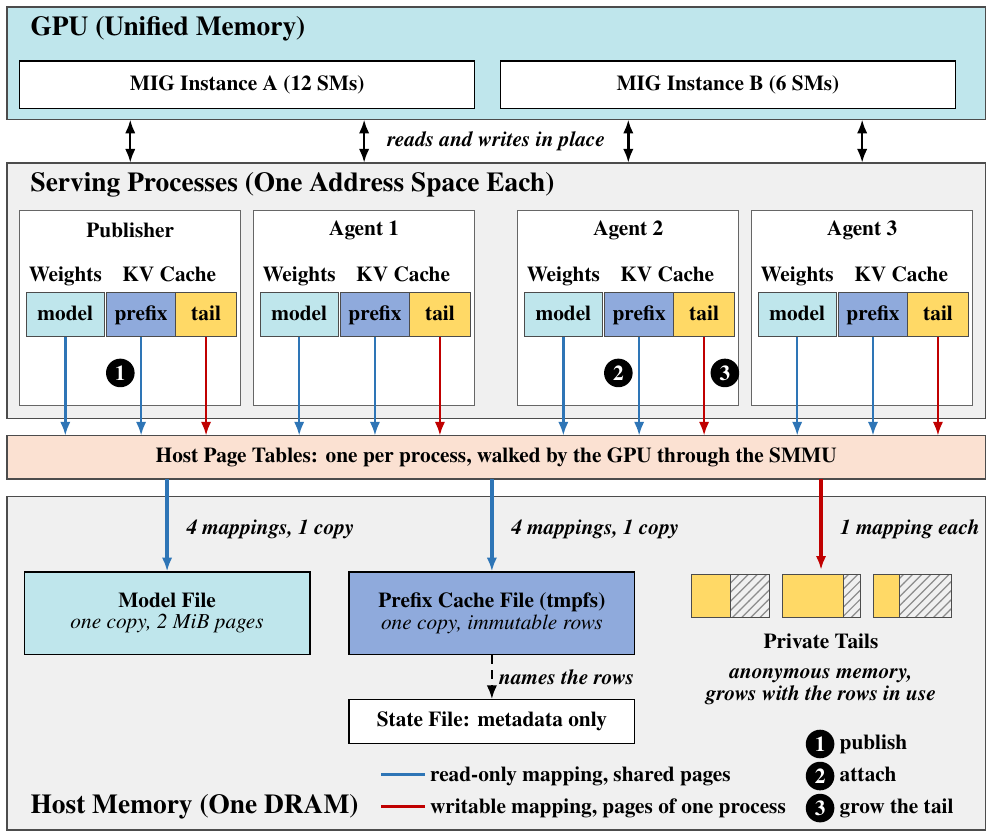</p>
<p align="center"><b>Figure 1.</b> Overall architecture. Every process maps the model file and the published rows of the prefix read-only and writes its own rows to a private tail; the GPU of either MIG instance reads all of it in place through the host page tables. (1) publish, (2) attach, (3) grow the tail.</p>

**Results** (7B model, six repetitions per cell, no failed run):

| What | Upstream | Here |
|---|---:|---:|
| Memory of 8 processes, weights only | 40.8 GiB | 10.0 GiB |
| Memory of 8 agents on a 16,321-token prefix (weights in place in both) | 19.9 GiB | 5.7 GiB + 0.9 GiB once |
| Handing a 16,321-token prefix to other processes | 561 ms, 893 MiB file | 9 ms, 0.25 MiB file |
| Attaching to it, one agent | 225 ms | 43 ms |
| Pause of a running process that forks its state to four children | 218 ms | 3 ms |
| Text of every agent | reference | identical |
| Generation speed | 1.00 | 1.00 in the 12-SM instance, 0.94 to 0.98 in the 6-SM instance |

**What this is not.** Agents that can live in one process should: the engine
shares a prefix between the sequences of one process by itself, and batching
is faster (75.6 tokens/s in 2.5 GiB for eight agents, against 34 tokens/s in
5.7 GiB for eight processes on extents). Extents continue that sharing across
the process boundary and the MIG boundary. The best configuration measured,
one batching server in each MIG instance on one published prefix, generates
102.9 tokens/s in 2.4 GiB. Every part of the mechanism exists somewhere
(Section 2.4); what was not found is the combination through host page
tables. One device, one engine, one model.

## 2. Background

### 2.1 Platform

NVIDIA Jetson AGX Thor, kernel 6.8.12-1021-tegra, open GPU kernel modules
595.78 (`uvm_ats_mode=1`), CUDA 13.0. The GPU is bound to the address space of
a process through the ARM SMMUv3 (shared virtual addressing), so a CUDA kernel
reads and writes ordinary pageable host memory in place. The GPU is split into
two MIG instances without memory of their own, `2g.0gb` (12 SMs) and `1g.0gb`
(6 SMs).

### 2.2 What the engine does today

llama.cpp turns memory mapping off on integrated CUDA GPUs and copies the
weights into device memory; its CUDA backend cannot take a host mapping as a
buffer. It allocates and zeroes the key-value cache of the whole context when
the context is created. A prefix moves between processes through a state file
that holds the rows, which every process copies into its own cache.

### 2.3 Why not copy-on-write

Measured on this device (`docs/RESEARCH_HOSTMM_2026-10-05.md`):

<p align="center">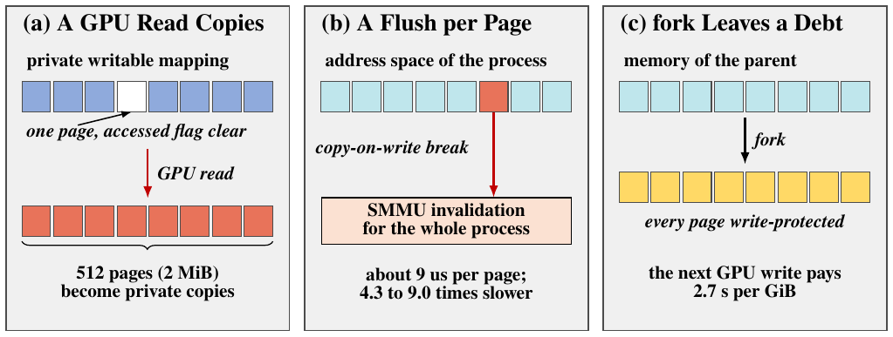</p>
<p align="center"><b>Figure 2.</b> Three properties of a GPU that follows the host page tables. (a) A GPU read of a page without the accessed flag is served as a write for its whole 2 MiB block. (b) Every page that changes owner costs the process an invalidation. (c) After <code>fork</code> the next GPU write pays for every page.</p>

| Property | Measurement |
|---|---|
| The GPU faults on a mapped page whose accessed flag is clear, and the driver serves a fault in a writable mapping as a write for the whole 2 MiB block around it | one such page turns 512 pages into private copies; one per block copies the whole object |
| A flush of one page costs a process that uses the GPU about 9 us, anywhere in its address space; a range operation costs nothing extra | copy-on-write break, reuse fault, per-page `mprotect` and `MADV_DONTNEED` are 4.3 to 9.0 times slower |
| After `fork`, the next GPU write to pre-fork memory pays for every page | 2.7 s per GiB; `posix_spawn` or `MADV_DONTFORK` avoid it |
| GPU-level sharing stops at the MIG boundary | CUDA IPC and CUDA's virtual memory interface share inside one instance and are refused across instances |
| A GPU fault of one MPS client ends every client of that server | 0 of 18 survive; time-sliced processes and the other MIG instance: 36 of 36 |

### 2.4 Closest prior work

| Work | What it does | What it does not |
|---|---|---|
| "The Ingestion Tax" (arXiv 2608.12114) | file-backed weights read in place, N processes on one copy, Apple hardware | no CUDA engine on an NVIDIA unified-memory device, no cache |
| llama.cpp pull request #22120 | host-pointer CUDA buffers on GB10, closed unmeasured | not measured, weights only |
| Omni-Flow (arXiv 2606.31093) | one copy of a cache pool shared by role processes, device memory, one GPU | no host page tables, no GPU partition boundary |
| SGLang issue #35648 | proposal: a cache slab exported by CUDA IPC to replicas under MPS | not implemented |
| llama.cpp pull request #21792 | cache tensors in a `MAP_SHARED` file with a metadata sidecar | CPU only |
| vAttention (ASPLOS 2025) | cache memory that follows use, device memory | one process |
| issue #81, MiaAI-Lab/Qwen3.8-Flash-Next-Single-DGX-Spark | reports the write-intent fault service of the driver | no amplification, no design |
| vLLM, SGLang, llama.cpp slots | a prefix shared between requests inside one process | stops at the process boundary |

Not claimed: reading weights in place, an immutable prefix with private
continuation, a cache that follows use, or cross-process cache sharing as
such. Claimed, within the audited set: the pages of a computed prefix mapped
through host page tables into the cache tensors of several GPU-serving
processes, across GPU partitions, and a running process that hands its state
on without a copy.

## 3. Design

### 3.1 Weights in place

The CUDA backend accepts a host mapping as a buffer (`GGML_CUDA_HOST_PTR=1`),
and the engine maps the model file shared and read-only as its weight buffer.
A read-only mapping cannot be turned into a private copy by a GPU read. One
pass of CPU reads over the file sets the accessed flags, which the GPU cannot
set, so that the first kernel does not fault on every page. A model on 2 MiB
pages (tmpfs with `huge=always`, or hugetlbfs) removes the cost of small
pages. A quantized tensor whose rows are not a multiple of 512 elements is
refused, because a read-only mapping has no room for row padding.

### 3.2 The key-value cache as extents

A cell of the cache is written once, when its token is decoded, and cells are
filled in order. With flash attention and one stream a cell is a row of every
key and value tensor, so the cells of a common prefix are a leading range of
every tensor (Figure 3):

<p align="center">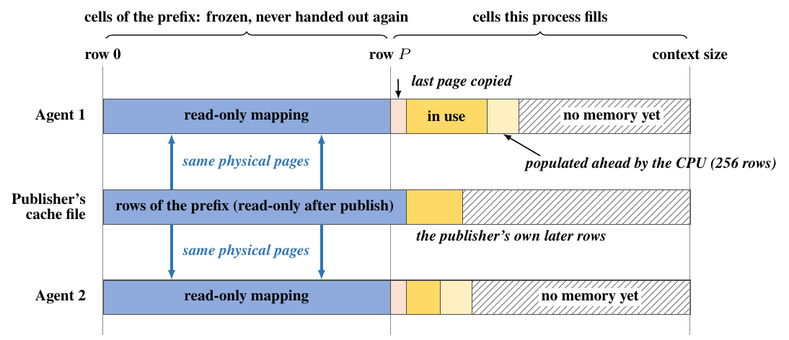</p>
<p align="center"><b>Figure 3.</b> One key or value tensor of the cache as extents. The rows of the prefix are the same physical pages in every agent, mapped read-only from the file of the publisher; the rows an agent writes lie in private memory that the CPU populates ahead of the GPU.</p>

- **Publish.** The cache of a publisher is a file on a tmpfs. Saving the state
  of its context writes the metadata of the cells (16 bytes per cell) and none
  of their rows, makes the rows in use read-only in the publisher with one
  `mprotect` per tensor, and marks their cells frozen.
- **Attach.** An agent maps the whole pages of the prefix rows from the file,
  private and read-only, at the start of each tensor, copies the last, partly
  filled page, and keeps the rest private. A CPU read pass sets the accessed
  flags. Loading the state file restores the metadata; no row is read.
- **Frozen cells.** The cache never hands out a frozen cell, so an agent that
  drops or rewrites tokens of the prefix gets cells in its own tail. Behind
  that sits the page protection: a write through the mapping is a fault in the
  process that tried.
- **A tail that follows use.** The private part starts without memory; before
  the device writes the cells of a batch, the CPU populates their pages.
  Populating absent pages needs no invalidation.
- **Fork.** A publisher that has saved its state keeps running; its next cells
  lie after the frozen ones. Children attach as agents.
- **Move.** Publish, attach in another process, end the publisher. The file
  outlives the process that filled it.

All of it is host mappings, so it holds between the two MIG instances.

<p align="center">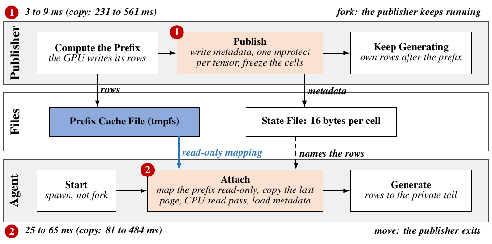</p>
<p align="center"><b>Figure 4.</b> Publish and attach as operations on mappings. A fork is the same with the publisher still running; a move ends the publisher.</p>

### 3.3 Implementation

| Piece | Where |
|---|---|
| weights in place | `inplace_weights.patch`: 59 lines added to `ggml-cuda.cu`; clone `llama.cpp/` |
| cache as extents | `kv_extents.patch`: the above plus 30 lines in `ggml-cuda.cu`, 397 in `llama-kv-cache.cpp`, 3 in its header; clone `llama.cpp-kv/` |
| device-memory counterpart, for comparison only | `kv_vmm.patch`: the above plus a cache made of 2 MiB allocations of CUDA's virtual memory interface; clone `llama.cpp-vmm/` |

The computation graph is unchanged. The mode is chosen by the environment of
the process (Section 7); without it the engine behaves as upstream.

## 4. Evaluation

Model: Qwen2.5-7B-Instruct, Q4_K_M (4.36 GiB). Six repetitions per cell with
alternating order and, where two instances are involved, alternating roles;
ratios are paired with 95% confidence intervals. Gates are written into the
runners before a campaign and the runners are pinned by hash.
`verify_llm_share_artifact.sh` rebuilds every summary from its raw log and
re-evaluates the relations below without the GPU.

### 4.1 Weights in place (record Sections 3 to 5)

<p align="center">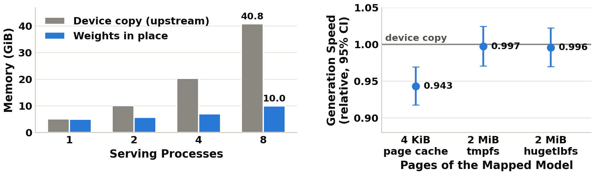</p>
<p align="center"><b>Figure 5.</b> Weights in place. Left: memory of N serving processes, placed in the two MIG instances alternately. Right: generation speed against the device copy by the page size of the mapped model.</p>

| Weights | Generation against device copy | Load (ms) | Memory outside the model file (MiB) |
|---|---|---:|---:|
| device copy (upstream) | 1.000 | 943 | 5,423 |
| in place, 4 KiB page cache | 0.943 [0.918, 0.969] | 516 | 878 |
| in place, 2 MiB pages (tmpfs) | 0.997 [0.971, 1.025] | 270 | not measured |

Text is identical. Eight processes hold 10.0 GiB instead of 40.8 GiB, under
MIG, time slicing and MPS alike; five processes with four adapters hold
9.9 GiB instead of 27.6 GiB and write the texts of their device-copy
counterparts (30 of 30).

### 4.2 Agents on one published prefix (record Section 6.4)

A publisher computes the prefix and exits; 1, 4 or 8 agent processes, every
second one in the other MIG instance, continue it with their own task.

<p align="center">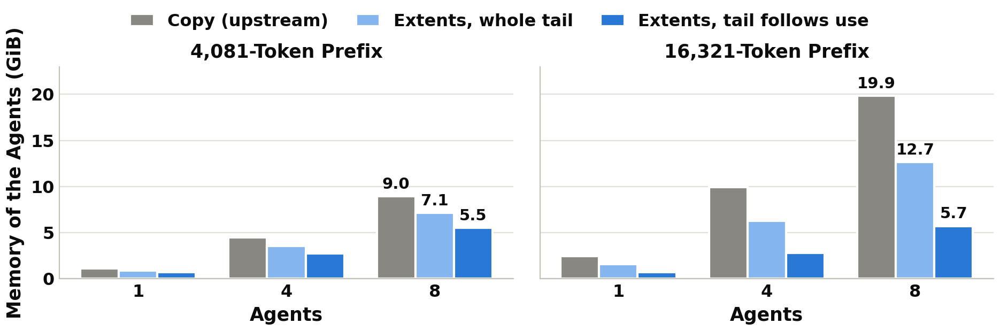</p>
<p align="center"><b>Figure 6.</b> Memory of the agents on one published prefix. The cache file (0.2 and 0.9 GiB) exists once and is not included.</p>
<p align="center">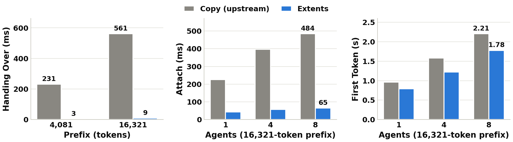</p>
<p align="center"><b>Figure 7.</b> Handing a prefix over, attaching to it, and the first token after process start.</p>

| 16,321-token prefix | Copy from the state file (upstream) | Extents, whole tail | Extents, tail follows use |
|---|---:|---:|---:|
| Handing over (ms) / state file (MiB) | 561 / 893 | 9 / 0.25 | 9 / 0.25 |
| Attach, 1 / 4 / 8 agents (ms) | 225 / 396 / 484 | 70 / 93 / 92 | 43 / 57 / 65 |
| First token after process start, 1 / 8 agents (ms) | 964 / 2,205 | 845 / 1,774 | 791 / 1,778 |
| Memory of 8 agents (GiB) | 19.9 | 12.7 | 5.7 |
| Pages of the prefix mapped by 8 agents: resident sum / proportional share (MiB) | - | 7,140 / 1,025 | 7,140 / 908 |
| Texts equal to the copy | reference | 78 of 78 | 78 of 78 |

With a 4,081-token prefix: 231 ms against 3 ms to hand over, and 9.0, 7.1 and
5.5 GiB for eight agents. The first token moves by only 4 to 23%, because
loading the model dominates it; the gain is memory.

### 4.3 Against copy-on-write (record Section 6.7)

Eight agents obtain the 16,321-token prefix through a private writable
mapping of the publisher's cache file.

<p align="center">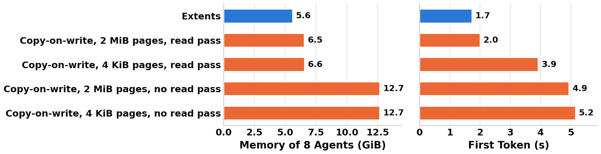</p>
<p align="center"><b>Figure 8.</b> Extents against copy-on-write mappings, eight agents on a 16,321-token prefix.</p>

| Way | Memory (GiB) | First token (s) | Decode of the agent's own task (s) |
|---|---:|---:|---:|
| extents | 5.6 | 1.7 | 0.32 |
| copy-on-write, 2 MiB file, CPU read pass | 6.5 | 2.0 | 0.60 |
| copy-on-write, 4 KiB file, CPU read pass | 6.6 | 3.9 | 2.5 |
| copy-on-write, no read pass (either page size) | 12.7 | 4.9 to 5.2 | 3.5 to 3.7 |

Without the read pass the mapping copies on read: every agent ends with a
private copy of the whole prefix although none of them writes it. With every
remedy applied copy-on-write comes close to extents; it has a state in which
the sharing is lost without an error, and extents do not.

### 4.4 A parent that forks while it runs (record Section 6.5)

A parent hands a 4,081-token prefix to four children, two in the other MIG
instance, and generates its own continuation while they generate theirs. It
pauses for 3 ms instead of 218 ms and writes the text of a process alone in
6 of 6 repetitions. Every child writes the text of the child that copies
(24 of 24). The children hold 2.8 GiB instead of 4.4 GiB.

### 4.5 Generation speed (record Section 6.8)

One process, cache in host memory against cache in device memory:

<p align="center">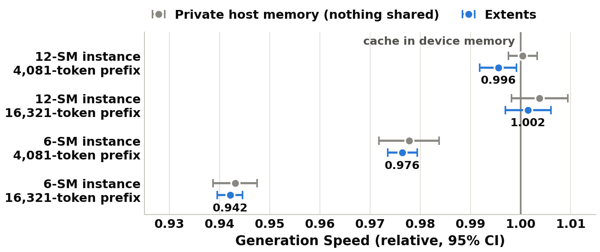</p>
<p align="center"><b>Figure 9.</b> Generation speed with the cache in host memory, relative to a cache in device memory.</p>

| MIG instance | 4,081-token prefix | 16,321-token prefix |
|---|---|---|
| 12-SM | 0.996 [0.992, 0.999] | 1.002 [0.997, 1.006] |
| 6-SM | 0.976 [0.974, 0.979] | 0.942 [0.940, 0.945] |

A private host-memory cache with nothing shared loses the same in the 6-SM
instance, so the cost belongs to host memory there and not to the mapping.
Its cause inside the GPU was not found. Two time-sliced processes in the
12-SM instance: 1.002.

### 4.6 Against sharing inside one process (record Section 6.10)

Eight agents on the 16,321-token prefix, 64 tokens each.

<p align="center">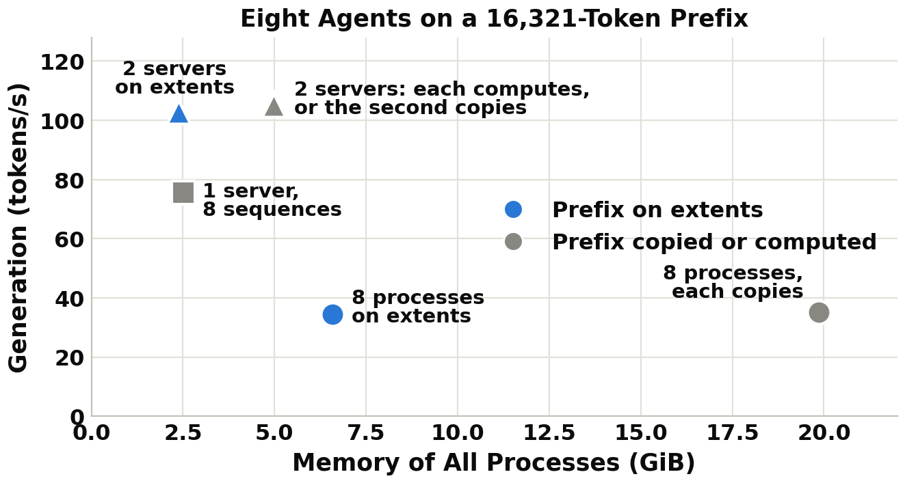</p>
<p align="center"><b>Figure 10.</b> Throughput against memory. Circles: eight processes; square: one batching server; triangles: one batching server in each MIG instance. The memory of the eight processes on extents includes the cache file.</p>

| Configuration | Generation (tokens/s) | Memory (GiB) | All agents ready (s) |
|---|---:|---:|---:|
| 8 processes, each copies the prefix | 35.0 | 19.9 | - |
| 8 processes on extents | 34.4 | 5.7 | - |
| one batching server, 8 sequences | 75.6 | 2.5 | 20.7 |
| a server in each MIG instance, each computes the prefix | 106.2 | 5.0 | 30.6 |
| a server in each MIG instance, the second copies | 105.0 | 5.0 | 22.2 |
| a server in each MIG instance, the second maps the prefix | 102.9 | 2.4 | 21.4 |

### 4.7 Against sharing in device memory (record Section 6.9)

The closest prior designs share a cache between processes in device memory.
`kv_vmm.patch` builds that into the same engine as a baseline of our own: the
cache consists of 2 MiB allocations of CUDA's virtual memory interface, and
a child maps the ones a prefix fills read-only. A parent and four children in
one MIG instance, 16,321-token prefix (12-SM / 6-SM instance):

<p align="center">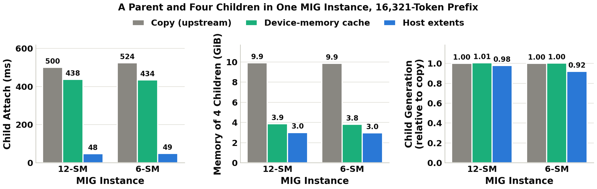</p>
<p align="center"><b>Figure 11.</b> Host extents against a cache in shared device memory and against the copy.</p>

| | Copy (upstream) | Device-memory cache | Host extents |
|---|---:|---:|---:|
| Pause of the parent (ms) | 551 / 571 | 41 / 39 | 8 / 9 |
| Child attach (ms) | 501 / 524 | 438 / 435 | 48 / 49 |
| Child first token (s) | 1.88 / 2.00 | 1.84 / 1.92 | 1.43 / 1.55 |
| Memory of the four children (GiB) | 9.9 / 9.9 | 3.9 / 3.8 | 3.0 / 3.0 |
| Child generation against the copy | 1.00 | 1.01 / 1.00 | 0.98 / 0.92 |
| Child texts equal to the copy | reference | 12 of 12 | 12 of 12 |
| A child in the other MIG instance | copies | refused (0 of 12) | runs (12 of 12) |

Inside one instance both work. Device memory keeps the generation speed of
device memory; host extents attach an order of magnitude faster, hold about a
fifth less, need a path and not a live exporter, and are the only one of the
two that reaches the other instance.

### 4.8 Isolation and placement (record Sections 4 and 5)

- A GPU fault of one MPS client ends the other clients of that server (0 of
  18 survive) and nobody else (36 of 36). The sharing of memory is the same
  under MIG, time slicing and MPS.
- Separate processes do not raise throughput: one MIG instance stays at 25 to
  29 tokens/s in total, however many processes share it.
- Each MIG instance computes the same cache bits every time; the two
  instances never compute the same bits (0 of 6). An agent that continues a
  prefix from the other instance writes what an agent that copies that state
  writes, not always what a recomputation in its own instance writes.

### 4.9 Gates that failed

| Gate, as stated before the campaign | Outcome |
|---|---|
| every agent writes the text of an agent that recomputes the prefix | fails for agents in the other MIG instance (12 of 36 and 24 of 36 equal), for the upstream copy as well; holds in the publisher's instance (42 of 42) and against the copy (78 of 78). Cause: the instances differ in their bits |
| extents keep 97% of the generation speed of the copy | fails in 2 of 6 cells (0.955, 0.970). Cause: the cost of host memory in the 6-SM instance |

## 5. Limits

- One device, one engine, one 7B model. Nothing was measured on DGX Spark,
  Grace Hopper or an Apple device.
- The cache experiments are driven by small programs (`kv_fork`, `kv_batch`,
  `kv_spawn`), not by `llama-server`.
- One level of fork: an agent cannot publish its own rows.
- Agents trust the publisher; whoever can write the cache file changes the
  prefix for all. Timing channels between processes that share a cache are
  not addressed. Sharing across MIG instances is for agents of one tenant.
- The cost of a host-memory cache in the 6-SM instance is measured, not
  explained.
- The cache must use flash attention and one stream; a frozen cell is lost to
  its agent; the cache file is unevictable memory on a device without swap.

## 6. Artifact

### 6.1 Layout

| File | Role |
|---|---|
| `llama.cpp/` + `inplace_weights.patch` | clone of llama.cpp at commit `6f767fe96` with the weights change |
| `llama.cpp-kv/` + `kv_extents.patch` | second clone at the same commit with the weights and the cache change |
| `llama.cpp-vmm/` + `kv_vmm.patch` | third clone with the device-memory counterpart as well; used by one campaign |
| `kv_fork.cpp` | one role of a prefix-sharing experiment: compute alone, publish as a parent, or attach as a child |
| `kv_batch.cpp` | the same roles for a batching server with several sequences |
| `kv_spawn.cpp` | a parent that publishes and starts its children itself, so that they inherit handles of shared device memory |
| `cuda_ipc_probe.cu`, `cuda_vmm_probe.cu` | which GPU-level route can share memory between two processes in a given placement |
| `cuda_share_load_probe.cu` | whether memory shared that way stays readable while a third process keeps the GPU busy (a diagnostic; no campaign) |
| `kv_file_diff.py` | compares two cache files value by value |
| `make_lora.py` | writes synthetic LoRA adapters for a GGUF model |
| `models/` | the model used by the campaigns (downloaded; not part of the artifact) |
| `summarize_*.awk`, `tables.py` | analysis and the tables of the record |
| `figures/` | the figures of this page: TikZ sources in `figures/src/`, `make_eval_figures.py` for the graphs (read from `results/`), `build.sh` builds both as PDF and PNG |
| `docs/` | the record, the substrate record and the prior-art audits; `docs/record_src/` holds the sections and tables of the record and `assemble.py`, which builds it |
| `results/` | raw logs, summaries, metadata and pinned source hashes of every campaign |
| `verify_llm_share_artifact.sh` | re-derives every packaged result from its raw log, no GPU |

| Runner | Measures | Section |
|---|---|---|
| `run_engine_single.sh`, `run_engine_pages.sh` | one process, device copy against in place; page size of the mapped model | 4.1 |
| `run_engine_adapters.sh` | five processes, four adapters, one base | 4.1 |
| `run_engine_agents.sh` | N processes under MIG, time slicing, MPS | 4.1, 4.8 |
| `run_engine_batched.sh`, `run_engine_groups.sh` | one process with N sequences; a batching server per MIG instance | 4.8 |
| `run_sharing_routes.sh`, `run_vmm_routes.sh` | CUDA IPC, CUDA's virtual memory interface, and the host page table for three placements | 2.3, 4.7 |
| `run_engine_prefix.sh` | a shared prefix with the engine's own tools | 4.2 |
| `run_engine_kvshare.sh` | N agents on one published prefix: recompute, copy, copy-on-write, extents | 4.2 |
| `run_engine_kvfork.sh` | a parent that hands its state to children and keeps generating | 4.4 |
| `run_engine_kvdet.sh` | the bits of a prefix cache across repetitions and MIG instances | 4.8 |
| `run_engine_kvcow.sh` | copy-on-write with and without the CPU read pass | 4.3 |
| `run_engine_kvspeed.sh` | generation speed with the cache in device and in host memory | 4.5 |
| `run_engine_kvbatch.sh` | eight agents in one batching server, and in one per MIG instance | 4.6 |
| `run_engine_kvvmm.sh` | extents against their device-memory counterpart and the copy | 4.7 |

### 6.2 Build

```bash
git clone <llama.cpp> llama.cpp && git -C llama.cpp checkout 6f767fe96
git -C llama.cpp apply ../inplace_weights.patch
cmake -S llama.cpp -B llama.cpp/build -DGGML_CUDA=ON -DCMAKE_BUILD_TYPE=Release \
  -DCMAKE_CUDA_ARCHITECTURES=110 -DLLAMA_CURL=OFF
cmake --build llama.cpp/build -j 12 --target llama-bench llama-completion \
  llama-batched-bench
python3 make_lora.py models/MODEL.gguf adapters/lora_1.gguf 1

# the engine with the cache change, and the drivers that link against it
git clone <llama.cpp> llama.cpp-kv && git -C llama.cpp-kv checkout 6f767fe96
git -C llama.cpp-kv apply ../kv_extents.patch
cmake -S llama.cpp-kv -B llama.cpp-kv/build -DGGML_CUDA=ON -DCMAKE_BUILD_TYPE=Release \
  -DCMAKE_CUDA_ARCHITECTURES=110 -DLLAMA_CURL=OFF
cmake --build llama.cpp-kv/build -j 12 --target llama-completion llama-bench
make                      # the probes, kv_fork, kv_batch

# the engine with the device-memory cache as well, and its two drivers
git clone <llama.cpp> llama.cpp-vmm && git -C llama.cpp-vmm checkout 6f767fe96
git -C llama.cpp-vmm apply ../kv_vmm.patch
cmake -S llama.cpp-vmm -B llama.cpp-vmm/build -DGGML_CUDA=ON -DCMAKE_BUILD_TYPE=Release \
  -DCMAKE_CUDA_ARCHITECTURES=110 -DLLAMA_CURL=OFF
cmake --build llama.cpp-vmm/build -j 12 --target llama
make kv_spawn kv_fork_vmm
```

`kv_extents.patch` contains `inplace_weights.patch`, and `kv_vmm.patch`
contains `kv_extents.patch`. Each clone carries exactly its patch. The clones,
the model, the adapters and the built programs are not in the repository.

### 6.3 Campaigns

GPU campaigns must not overlap. Campaigns that start MPS servers need a short
directory for the control socket (`MPS_ROOT`, at most about 85 characters) and
refuse to run while another MPS daemon is active. `run_engine_pages.sh` mounts
a tmpfs and a hugetlbfs and reserves a hugetlb pool with `sudo`; the
`run_engine_kv*.sh` runners except `run_engine_kvdet.sh` mount a tmpfs for the
cache files; all remove what they made on exit. Do not edit a runner while it
runs: the shell reads it as it goes.

```bash
RESULT_TAG=engine-single-rerun   ./run_engine_single.sh
RESULT_TAG=engine-pages-rerun    ./run_engine_pages.sh
RESULT_TAG=engine-adapters-rerun ./run_engine_adapters.sh
RESULT_TAG=engine-batched-rerun  ./run_engine_batched.sh
RESULT_TAG=engine-groups-rerun   ./run_engine_groups.sh
RESULT_TAG=engine-prefix-rerun   ./run_engine_prefix.sh
MPS_ROOT=/tmp/hm RESULT_TAG=engine-agents-rerun  ./run_engine_agents.sh
MPS_ROOT=/tmp/hm RESULT_TAG=sharing-routes-rerun ./run_sharing_routes.sh
MPS_ROOT=/tmp/hm RESULT_TAG=vmm-routes-rerun     ./run_vmm_routes.sh
RESULT_TAG=engine-kvshare-rerun  ./run_engine_kvshare.sh
awk -v table=publish -f summarize_engine_kvshare.awk \
  results/engine-kvshare-rerun/raw.log \
  >results/engine-kvshare-rerun/engine_kvshare_publish.csv
RESULT_TAG=engine-kvfork-rerun   ./run_engine_kvfork.sh
RESULT_TAG=engine-kvdet-rerun    ./run_engine_kvdet.sh
RESULT_TAG=engine-kvcow-rerun    ./run_engine_kvcow.sh
RESULT_TAG=engine-kvspeed-rerun  ./run_engine_kvspeed.sh
RESULT_TAG=engine-kvbatch-rerun  ./run_engine_kvbatch.sh
RESULT_TAG=engine-kvvmm-rerun    ./run_engine_kvvmm.sh
./verify_llm_share_artifact.sh
```

`verify_llm_share_artifact.sh` needs no GPU and runs on a fresh clone. It
checks each patch against its engine checkout when the checkout is present,
and the pinned sources of the substrate project when that project lies next
to this repository; it reports how many of the latter it skipped. Two runners
(`run_sharing_routes.sh`, and `tables.py` for two tables of Section 5 of the
record) use the substrate project and need it at `../thor_hostmm`.

To rebuild the record and the figures after a campaign:

```bash
python3 tables.py results ../thor_hostmm/results docs/record_src
python3 docs/record_src/assemble.py
figures/build.sh          # needs pdflatex, pdftoppm, matplotlib
```

## 7. Using the paths

### 7.1 Weights in place

```bash
GGML_CUDA_HOST_PTR=1 llama.cpp/build/bin/llama-completion -m MODEL.gguf -ngl 99 ...
```

- Every process that maps the same file shares its pages. Keep the file
  unwritable for the serving processes; whoever can write it changes the
  model for all of them.
- Put the model on a tmpfs mounted with `huge=always`, or on hugetlbfs, to
  remove the cost of 4 KiB pages.
- `GGML_CUDA_HOST_PTR_PREREAD=0` skips the CPU read of every page.
- Under MPS a GPU fault of one client ends the work of every client of that
  server. Put processes that must survive each other's faults into different
  MIG instances or run them without MPS.

### 7.2 The cache as extents

The cache change is selected by the environment of a process that uses
`llama.cpp-kv`; without `LLAMA_KV_HOST` the engine behaves as upstream.

```bash
# publisher: computes the prefix; its cache is the file /mnt/kv/prefix.0
GGML_CUDA_HOST_PTR=1 LLAMA_KV_HOST=/mnt/kv/prefix LLAMA_KV_GROW=256 \
  ./kv_fork parent MODEL.gguf 8192 prefix.txt prefix.state "" 0
# agent: maps the first 4081 rows read-only, writes its own rows after them
GGML_CUDA_HOST_PTR=1 LLAMA_KV_HOST=/mnt/kv/prefix LLAMA_KV_PREFIX=4081 \
  LLAMA_KV_GROW=256 ./kv_fork child MODEL.gguf 8192 prefix.state "QUESTION" 64
```

| Variable | Meaning |
|---|---|
| `LLAMA_KV_HOST=anon` | the cache is private host memory |
| `LLAMA_KV_HOST=PATH` | publisher: the cache is the file `PATH.0`; saving the state of the context publishes the rows in use |
| `LLAMA_KV_PREFIX=ROWS` | with the above: agent; the first `ROWS` rows are a read-only mapping of the file |
| `LLAMA_KV_GROW=ROWS` | memory follows the rows in use, `ROWS` at a time |
| `LLAMA_KV_COW=1` or `2` | the alternative the measurements argue against: the agent maps the whole file writable and private; `2` leaves out the CPU read pass |
| `LLAMA_KV_VMM=1`, `LLAMA_KV_VMM_IMPORT` | `llama.cpp-vmm` only: the device-memory counterpart |

- Saving the state of a publisher (`llama_state_save_file`, or
  `--prompt-cache` of `llama-completion`) publishes. An agent loads that
  state file and no other; an agent cannot save its own state.
- Put the cache file on a tmpfs mounted with `huge=always` and keep it
  unwritable for the agents.
- Put agents with a long shared prefix into the 12-SM instance (Section 4.5).
- Start agents with `posix_spawn` or `exec`, not with `fork` of a process
  that has used the GPU.
- Agents that can live in one process should (Section 4.6).
